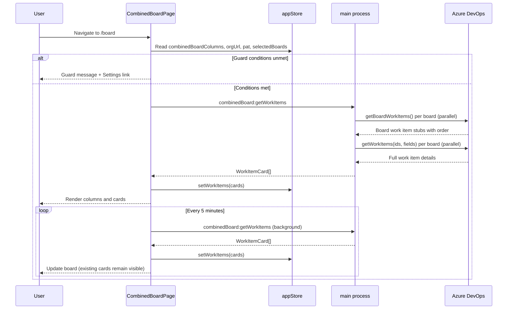
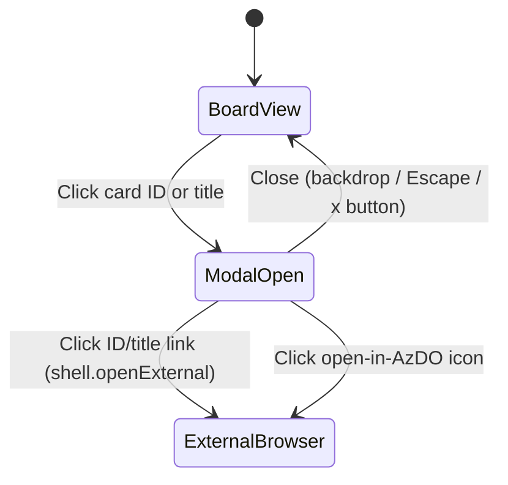

# Combined board

## Summary

Implement the Combined Board view — a read-only Kanban board that aggregates work items from all selected AzDO boards into a single consolidated view, ordered by the column configuration defined in Settings → Combined Board. Work items load automatically on page navigation and refresh every 5 minutes, with a manual Refresh button available at all times. Clicking a card opens a read-only detail modal displaying all non-empty AzDO fields rendered as sanitised HTML. Filtering and write operations are out of scope for this feature.

## Detailed description

### Page layout

`CombinedBoardPage` renders a full-height, full-width board split into a **toolbar** (top) and a **column area** (flex row, overflow-x scroll).

**Toolbar** (sticky, above the columns):
- Application/page heading: "Combined Board".
- "Last refreshed at {HH:MM}" timestamp, updated after each successful fetch.
- A **Refresh** button with a spinner icon while a refresh is in progress. Disabled during active fetching.

**Column area:**
- One column per entry in `combinedBoardColumns` (from the store), rendered left to right in their configured order.
- Each column has a fixed minimum width (~280 px) so the area scrolls horizontally when columns overflow the viewport.
- Vertical overflow is `auto` **per column independently** — scrolling inside one column does not affect others. The outer area does not scroll vertically.

### Guard states

The page renders a guard message instead of the board when preconditions are unmet:

| Condition | Message |
|---|---|
| No `orgUrl` / `pat` in store | "Configure your connection in Settings to use the Combined Board." + link to Settings → Connection |
| `selectedBoards` is empty | "Select at least one remote board in Settings to use the Combined Board." + link to Settings → Remote Boards |
| `combinedBoardColumns` is empty | "Configure your Combined Board columns in Settings." + link to Settings → Combined Board |

### Board loading states

| State | UI |
|---|---|
| Initial load (no data yet) | Full-board spinner overlay with "Loading board…" label |
| Refreshing (data already shown) | Spinner shown inside the Refresh button; existing cards remain visible |
| Load error (initial) | Full-board error message + Retry button |
| Per-column fetch error | Inline error message within the column card area + Retry link; other columns load normally |
| Empty column | "No items" message in the column body |
| Loaded | Column cards with work item cards |

### Data fetching

A new `azdo.ts` function `fetchWorkItemsForBoard({ orgUrl, pat, board })` uses the following strategy per selected board:

1. Call `workApi.getBoardWorkItems(teamContext, boardId)` to get work items on the board with their column assignments and board-order index.
2. Collect the work item IDs.
3. Call `witApi.getWorkItems(ids, fields)` with a broad set of fields (Title, WorkItemType, AssignedTo, Tags, Description, and all fields returned by the API) to get full field details.
4. Join the board-order data from step 1 onto the work item details from step 3.

Fetching is done in parallel across all selected boards. Results are stored in `appStore` as `WorkItemCard[]` — not persisted to `config.json`.

**Auto-refresh**: An interval (5 minutes) triggers a background re-fetch. The toolbar Refresh button also triggers an immediate re-fetch. Both share the same async fetch path.

**IPC**: A new handler `combinedBoard:getWorkItems` in `main.ts` calls `fetchWorkItemsForBoard` for each selected board in parallel and returns the flat results.

### Column rendering

Each combined column renders:
- **Column header**: the combined column name (from `CombinedBoardColumn.name`).
- **Card list**: work items grouped first by their source mapping order (i.e., the index of their `CombinedBoardColumnMapping` in `sourceMappings`), then within each group by their board-order index (from `getBoardWorkItems`).

Cards from the first source mapping appear at the top, cards from the second mapping below, and so on.

### Card component

Each work item card shows:
- **Type icon**: coloured SVG icon keyed on `System.WorkItemType`. Known types: Bug (red), User Story (blue), Task (yellow), Feature (purple), Epic (orange), Test Case (teal). Unknown / custom types receive a neutral grey square icon with the type name as a tooltip.
- **Team name**: small secondary label (the board's `teamName`).
- **Card ID + title**: e.g. `#1234 Fix login regression`. Clicking either opens the card detail modal.
- **Assignee**: display name of `System.AssignedTo`, or omitted if unassigned.
- **Tags**: each tag from `System.Tags` shown as a small pill.
- **Open in AzDO icon**: a link icon that calls `shell.openExternal` with the deep link `{orgUrl}/{projectName}/_workitems/edit/{id}`. Shown at the card's top-right corner.

### Card detail modal

Opened by clicking the card ID or title. A large centred modal overlay (with a dimmed backdrop) showing:

**Header section** (non-collapsible):
- Work item type icon (same logic as the card) + type name.
- Work item ID + title as a hyperlink that calls `shell.openExternal` to open the card in the system browser.
- Assignee display name (or "Unassigned").
- Tags as pills.

**Content sections** (each collapsible):
- **Ordered known fields first**: Description, Acceptance Criteria (if non-empty), Repro Steps (if non-empty), System Info (if non-empty).
- **All other non-empty fields**: rendered in alphabetical order by display name. Fields with empty/null values are omitted.
- Each section has a collapsible toggle (chevron button). All sections start expanded.
- Rich text (HTML) values are rendered with `dangerouslySetInnerHTML` after sanitisation with **DOMPurify** (new dependency).
- Plain text values are rendered as Markdown as appropriate.

Closed by clicking the backdrop, pressing Escape, or a close button in the modal header.

### Deep links

The AzDO deep link format is: `{orgUrl}/{projectName}/_workitems/edit/{workItemId}`

All external navigation uses `window.electron.openExternal(url)` (a new IPC channel wrapping `shell.openExternal`).

### Stale mapping handling

If a source mapping in a combined column has no work items in the fetched data, the column still renders showing "No items". If the entire fetch for a board fails, the affected columns display the per-column error state.

## User stories

- *As a user, I want to see all work items across my selected AzDO boards in a single Kanban view, so that I can track progress across multiple projects without switching between AzDO boards.*
- *As a user, I want the board to refresh automatically, so that I see reasonably up-to-date information without manual action.*
- *As a user, I want to click a card to view its full details, so that I can read the description and custom fields without leaving the application.*
- *As a user, I want to open a card directly in AzDO from the board or detail view, so that I can take action on items I need to update.*

## Key decisions

| Decision | Outcome |
|---|---|
| Refresh strategy | Auto-load on navigation + 5-minute timed auto-refresh + manual Refresh button. Keeps data current without constant polling. |
| Card ordering | `getBoardWorkItems()` API to match AzDO visual column order. Provides the board-rank index natively without a secondary WIQL query. |
| Detail modal content | All non-empty fields rendered dynamically. Known fields (Description, Acceptance Criteria, Repro Steps) appear first; remaining fields in alphabetical order. Handles custom work item types without hardcoding layouts per type. |
| HTML rendering | Sanitised HTML via DOMPurify + `dangerouslySetInnerHTML`. AzDO stores rich text as HTML; converting to Markdown loses fidelity. DOMPurify mitigates XSS risk. |
| Work item type icons | Coloured SVG icon for known types; neutral grey icon with type-name tooltip for unknown/custom types. Avoids dependency on AzDO icon URLs. |
| Filtering | Deferred. Out of scope for this feature. |
| Write operations | Deferred. Board is read-only; no drag-to-move or inline editing. |

## Diagrams

### Board load sequence



### Card detail modal states



## Acceptance criteria

```gherkin
Feature: Combined board view

  Background:
    Given the user has configured their AzDO connection
    And the user has selected at least one remote board
    And the user has configured at least one combined board column with source mappings

  Scenario: Board loads automatically on navigation
    When the user navigates to the Combined Board page
    Then a loading spinner is shown covering the board
    And work items are fetched from AzDO for all selected boards
    And when loading completes the board displays columns with their work item cards

  Scenario: Columns appear in configured order
    Given combined board columns are configured as ["Todo", "In Progress", "Done"]
    When the board loads
    Then the columns are displayed left to right as "Todo", "In Progress", "Done"

  Scenario: Cards are ordered by source mapping order then by board order
    Given a combined column "In Progress" has source mappings [Team A / Active, Team B / Doing]
    And Team A / Active contains cards in board order [Card 5, Card 2, Card 9]
    And Team B / Doing contains cards in board order [Card 1, Card 7]
    When the board loads
    Then the "In Progress" column shows cards in order: Card 5, Card 2, Card 9, Card 1, Card 7

  Scenario: Card shows required fields
    Given a work item with type "Bug", assigned to "Jane Smith", tags "ux, critical" is in the board
    When the board loads
    Then the card displays a red bug type icon
    And the card displays the assignee "Jane Smith"
    And the card displays "ux" and "critical" as tag pills

  Scenario: Custom work item type shows generic icon
    Given a work item with type "Tech Debt" is in the board
    When the board loads
    Then the card shows a grey generic icon
    And hovering the icon shows the tooltip "Tech Debt"

  Scenario: The open-in-AzDO icon opens the work item in the system browser
    Given a card is visible for work item #42 in project "MyProject"
    When the user clicks the open-in-AzDO icon on the card
    Then the system browser opens "{orgUrl}/MyProject/_workitems/edit/42"
    And the application remains open

  Scenario: Clicking a card title opens the detail modal
    When the user clicks the title of a card
    Then a large modal opens showing the card details
    And the modal backdrop dims the board behind it

  Scenario: Card detail modal shows all non-empty fields
    Given a work item has a Description, Acceptance Criteria, and a custom field "Business Value"
    And the work item does not have Repro Steps populated
    When the user opens the card detail modal
    Then the modal shows "Description", "Acceptance Criteria", and "Business Value" sections
    And "Repro Steps" is not shown
    And Description and Acceptance Criteria appear before "Business Value"

  Scenario: Card detail modal renders rich HTML content
    Given a work item Description contains HTML with bold text and a bulleted list
    When the user opens the card detail modal
    Then the Description section renders the bold text and bulleted list correctly
    And no raw HTML markup is visible to the user

  Scenario: Card detail modal renders Markdown content
    Given a work item Description contains non-HTML (markdown)
    When the user opens the card detail modal
    Then the Description section renders the markdown correctly
    And no raw Markdown content is visible to the user

  Scenario: Content sections are collapsible
    When the user opens the card detail modal
    Then all content sections are expanded by default
    When the user clicks the toggle on the "Description" section
    Then the Description content collapses
    When the user clicks the toggle again
    Then the Description content expands

  Scenario: The title link in the detail modal opens AzDO in the system browser
    When the user opens the card detail modal for work item #99
    And clicks the "#99 <title>" link in the modal header
    Then the system browser opens "{orgUrl}/{projectName}/_workitems/edit/99"
    And the modal remains open

  Scenario: Closing the detail modal with Escape
    Given the card detail modal is open
    When the user presses Escape
    Then the modal closes and the board is visible

  Scenario: Closing the detail modal by clicking the backdrop
    Given the card detail modal is open
    When the user clicks the dimmed backdrop outside the modal
    Then the modal closes and the board is visible

  Scenario: Board auto-refreshes every 5 minutes
    Given the board has loaded
    When 5 minutes elapse
    Then the board silently re-fetches work items in the background
    And the existing cards remain visible during the refresh
    And the "Last refreshed at" timestamp updates after the refresh completes

  Scenario: Manual refresh
    Given the board has loaded
    When the user clicks the Refresh button
    Then the Refresh button shows a spinner
    And the existing cards remain visible
    And when the fetch completes the spinner stops and the timestamp updates

  Scenario: Guard — no connection configured
    Given no AzDO connection has been configured
    When the user navigates to the Combined Board page
    Then no board is shown
    And the message "Configure your connection in Settings to use the Combined Board." is displayed
    And a link to Settings → Connection is shown

  Scenario: Guard — no boards selected
    Given an AzDO connection is configured but no remote boards have been selected
    When the user navigates to the Combined Board page
    Then the message "Select at least one remote board in Settings to use the Combined Board." is displayed

  Scenario: Guard — no combined columns configured
    Given boards are selected but no combined columns have been configured
    When the user navigates to the Combined Board page
    Then the message "Configure your Combined Board columns in Settings." is displayed

  Scenario: Per-column error when one board fails to load
    Given one of the selected boards is unreachable
    When the board loads
    Then columns sourced from the failed board show an inline error message
    And columns sourced from other boards display their work items normally

  Scenario: Empty column
    Given a combined column source mapping refers to a board column with no work items
    When the board loads
    Then the column body shows "No items"
    And no error is shown

  Scenario: Horizontal scrolling for many columns
    Given more combined columns exist than fit the viewport width
    When the board loads
    Then the column area is horizontally scrollable

  Scenario: Independent vertical scroll per column
    Given a column has more cards than fit its visible height
    When the user scrolls down inside that column
    Then only that column scrolls
    And the other columns remain at their previous scroll position
```

## Manual test steps

### Prerequisites
1. Open the application and configure a valid AzDO connection (Settings → Connection).
2. Select at least two remote boards from different projects or teams (Settings → Remote Boards).
3. Configure at least two combined board columns with source mappings (Settings → Combined Board).
4. Navigate to the Combined Board page via the main navigation.

### Initial load and toolbar
5. Verify a full-board loading spinner appears briefly while work items are fetched.
6. Verify work items appear under the correct combined columns once loading completes.
7. Verify the toolbar shows "Last refreshed at HH:MM" with the current time.
8. Verify a Refresh button is visible in the toolbar.

### Column and card ordering
9. Verify the combined columns appear left-to-right in the same order as configured in Settings → Combined Board.
10. For a combined column with two source mappings, verify all cards from the first source mapping appear above all cards from the second source mapping.
11. Verify the card order within each source mapping group matches the visual order in the corresponding AzDO board.

### Card content
12. Verify each card shows: team name (secondary text), type icon, work item ID and title, assignee or nothing if unassigned, and any tags as pills.
13. Find a Bug work item and verify its icon is red. Find a User Story and verify its icon is blue.
14. If a custom work item type is available (e.g. "Tech Debt"), verify the card shows a grey icon and hovering it shows the type name as a tooltip.
15. Click the open-in-AzDO icon on a card. Verify the system browser opens the correct AzDO URL and the application stays open.

### Card detail modal
16. Click the ID or title of a card. Verify the detail modal opens with a dimmed backdrop.
17. Verify the modal header shows: type icon, type name, ID + title as a hyperlink, assignee, tags, and a close button.
18. Click the ID/title hyperlink. Verify the system browser opens the AzDO URL and the modal remains open.
19. Verify the Description is rendered as formatted text (bold, bullets, etc.) with no raw HTML visible.
20. If the card has Acceptance Criteria or Repro Steps, verify they appear below Description.
21. If the card has custom fields, verify they appear after the known fields in alphabetical order.
22. Confirm that any fields with no value are absent.
23. Click the toggle/chevron next to "Description". Verify the content collapses. Click again and verify it expands.
24. Press Escape. Verify the modal closes.
25. Open the modal again and click the dimmed backdrop. Verify the modal closes.
26. Open the modal and click the × close button. Verify the modal closes.

### Refresh
27. Click the Refresh button. Verify a spinner appears inside the button while existing cards remain visible.
28. Verify the spinner stops and "Last refreshed at" updates when the fetch completes.

### Guards
29. Clear the AzDO connection in Settings. Navigate to the Combined Board. Verify the guard message about configuring the connection is shown and a link to Connection settings is present.
30. Restore the connection, remove all selected boards, navigate to the Combined Board. Verify the guard message about selecting boards is shown.
31. Re-add a board, remove all combined columns from Settings → Combined Board, navigate to the Combined Board. Verify the guard message about configuring combined columns is shown.

### Scrolling
32. Configure enough combined columns to exceed the viewport width. Verify horizontal scrolling works.
33. Ensure at least one column has enough cards to exceed its visible height. Scroll within that column and verify adjacent columns do not scroll.

## Implementation tasks

Tasks are ordered by dependency. File references are relative to `src/`.

### 1. Add `WorkItemCard` type and new IPC methods to the shared API surface
**File**: `shared/electronAPI.ts`

Add `WorkItemCard` interface and extend `ElectronAPI`:
```typescript
export interface WorkItemCard {
    id: number;
    title: string;
    workItemType: string;
    assignedTo?: string;
    tags: string[];
    boardId: string;
    boardName: string;
    projectId: string;
    projectName: string;
    teamName: string;
    columnId: string;
    columnName: string;
    url: string;
    boardOrder: number;
    fields: { name: string; displayName: string; value: string }[];
}
```
Add to `ElectronAPI`:
```typescript
getWorkItems: () => Promise<{ cards?: WorkItemCard[]; error?: string }>;
openExternal: (url: string) => Promise<void>;
```

### 2. Implement `fetchWorkItemsForBoard` in `azdo.ts`
**File**: `azdo.ts`
**Depends on**: Task 1

Add an exported async function `fetchWorkItemsForBoard({ orgUrl, pat, board })`:
1. Call `workApi.getBoardWorkItems(teamContext, board.boardId)` to get board-ordered column assignments.
2. Collect work item IDs.
3. Call `witApi.getWorkItems(ids, undefined, undefined, WorkItemExpand.Fields)` for full fields.
4. Join board order and column info from step 1 onto each work item.
5. Map to `WorkItemCard[]`, building `fields` from all non-null `workItem.fields` entries.
6. Wrap in `try/catch` that logs a warning and returns `[]` on failure (pattern: `fetchBoardColumns`).

### 3. Add IPC handlers in `main.ts`
**File**: `main.ts`
**Depends on**: Task 2

- `ipcMain.handle("combinedBoard:getWorkItems", async () => { ... })`: loads config + selected boards, calls `fetchWorkItemsForBoard` per board via `Promise.all`, returns `{ cards }` or `{ error }`. Pattern: `boards:getBoardColumnsForSelected`.
- `ipcMain.handle("shell:openExternal", async (_, url: string) => shell.openExternal(url))`.
- Import `shell` from `electron`.

### 4. Expose new IPC in `preload.ts`
**File**: `preload.ts`
**Depends on**: Task 3

Add to the contextBridge-exposed object:
```typescript
getWorkItems: () => ipcRenderer.invoke("combinedBoard:getWorkItems"),
openExternal: (url: string) => ipcRenderer.invoke("shell:openExternal", url),
```

### 5. Add `workItems` to `appStore.ts`
**File**: `renderer/store/appStore.ts`
**Depends on**: Task 1

Add `workItems: WorkItemCard[]` (default `[]`) and `setWorkItems: (cards: WorkItemCard[]) => void`. Pattern: `boardColumns` / `setBoardColumns`.

### 6. Install DOMPurify
- `npm install dompurify`
- `npm install --save-dev @types/dompurify`

### 7. Create `WorkItemTypeIcon` component
**File**: `renderer/components/Shared/WorkItemTypeIcon.tsx`

Props: `workItemType: string`. Returns an inline SVG:

| Type | Fill colour |
|---|---|
| Bug | #CC293D |
| User Story | #009CCC |
| Task | #F2CB1D |
| Feature | #773B93 |
| Epic | #FF7B00 |
| Test Case | #107C10 |
| (other) | #6B7280 (grey) with `<title>{workItemType}</title>` |

Use simple geometric shapes (circle for Bug, bookmark for User Story, square for Task, etc.) to approximate AzDO's icon style.

### 8. Create `BoardCard` component
**File**: `renderer/components/Board/BoardCard.tsx`
**Depends on**: Task 7

Props: `card: WorkItemCard`, `onOpen: (card: WorkItemCard) => void`.

Render: team name (secondary text), `WorkItemTypeIcon`, card ID + title as a `<button>` calling `onOpen`, assignee, tags, open-in-AzDO icon button calling `window.electron.openExternal(card.url)`.

Style consistent with existing card elements in `CombinedBoardSection.tsx` (border, `rounded-md`, `px-3 py-2`, etc.).

### 9. Create `CardDetailModal` component
**File**: `renderer/components/Board/CardDetailModal.tsx`
**Depends on**: Tasks 6, 7

Props: `card: WorkItemCard | null`, `onClose: () => void`.

- Renders `null` when `card` is `null`.
- Fixed full-screen backdrop (`bg-black/50 z-40`) with click handler calling `onClose`.
- Centred panel with `max-w-3xl`, `overflow-y-auto`, `max-h-[90vh]`.
- Escape key via `useEffect` (pattern: `SourceColumnPicker` in `CombinedBoardSection.tsx`).
- Header: `WorkItemTypeIcon`, type name, ID + title as `<button>` calling `window.electron.openExternal`, assignee, tags, `×` close button.
- Content: collapsible sections via `useState` map (section name → boolean). Default all `true` (expanded).
- Field ordering: Description → Acceptance Criteria → Repro Steps → System Info → remaining fields (sort by `displayName`).
- HTML detection: if `value` starts with `<` use DOMPurify + `dangerouslySetInnerHTML`; otherwise render Markdown content.

### 10. Implement `CombinedBoardPage`
**File**: `renderer/pages/CombinedBoardPage.tsx`
**Depends on**: Tasks 1, 5, 8, 9

Replace the stub:
- Read `orgUrl`, `pat`, `selectedBoards`, `combinedBoardColumns`, `workItems`, `setWorkItems` from `useAppStore`.
- Guard order: no credentials → guard; no boards → guard; no combined columns → guard.
- `useState`: `isLoading`, `isRefreshing`, `error`, `lastRefreshedAt`, `selectedCard`.
- `useEffect` on mount: call `window.electron.getWorkItems()`, set `workItems`, clear `isLoading`.
- `useEffect` for auto-refresh: `setInterval` (300 000 ms) calling `getWorkItems` in background; clear on unmount.
- Per combined column: flat list of cards = `combinedColumn.sourceMappings.flatMap((m, i) => workItems.filter(c => c.boardId === m.boardId && c.columnId === m.columnId).sort((a, b) => a.boardOrder - b.boardOrder).map(c => ({ ...c, _groupIndex: i })))`.
- Column layout: `flex flex-col min-w-[280px] h-full overflow-y-auto`.
- Outer: `flex flex-row flex-1 overflow-x-auto overflow-y-hidden`.
- Render `BoardCard` per card; clicking sets `selectedCard`.
- Render `<CardDetailModal card={selectedCard} onClose={() => setSelectedCard(null)} />`.
- Toolbar: page heading, `lastRefreshedAt` label, Refresh button (disabled + spinner when `isRefreshing`).
