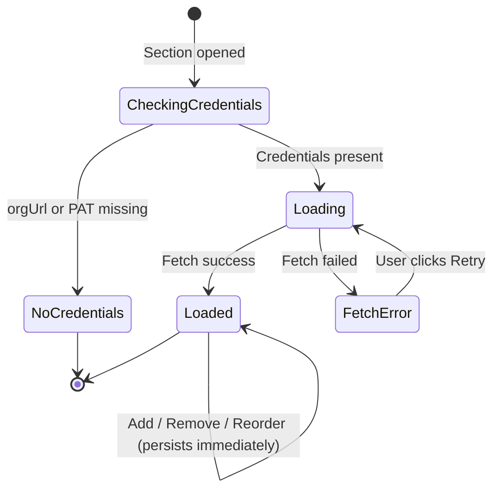
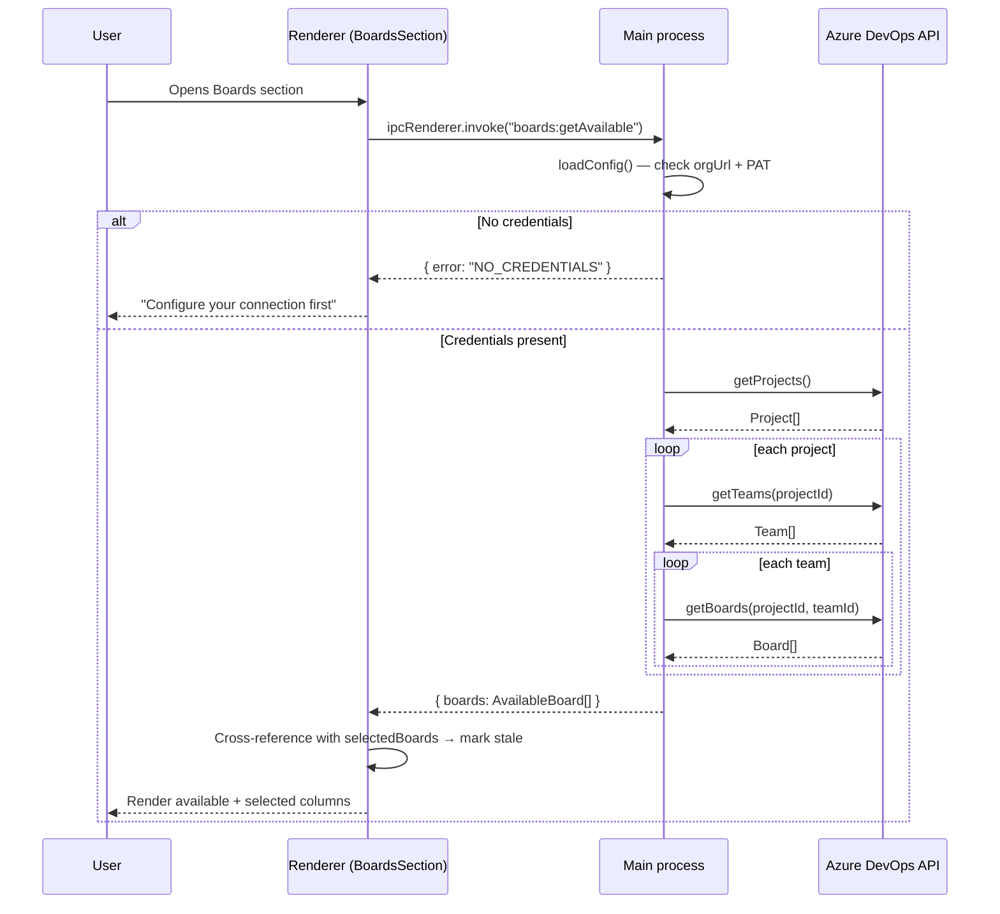
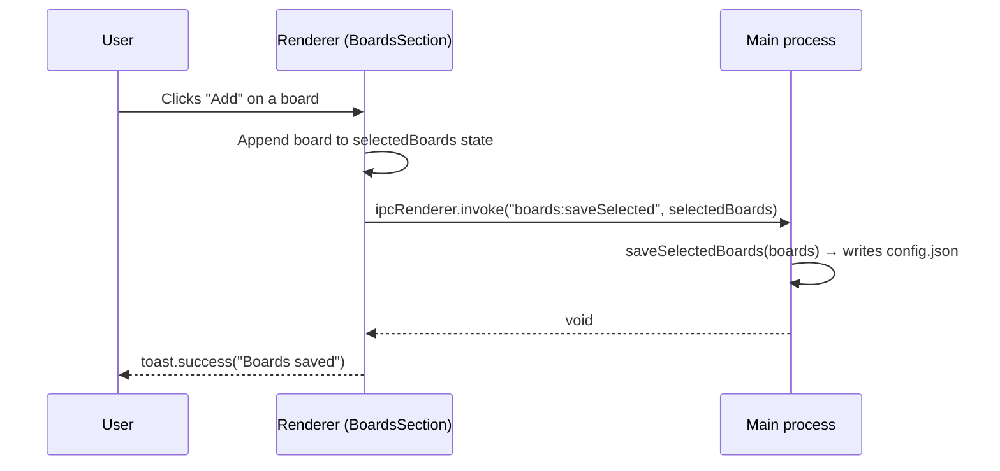

# Configure boards

## Summary

A new "Boards" section in the Settings area allows users to select which Azure DevOps boards the application tracks. Available boards are fetched fresh from the configured AzDO organisation each time the section is opened and listed grouped by project, with all boards from all teams within each project flattened under the project heading. Users move boards into an ordered "Selected boards" list using add/remove buttons, and can drag-and-drop to reorder them. All changes persist immediately to `config.json`. The selected board order will drive the column order in the Combined Board view.

## Detailed description

### Layout

The Boards section uses a two-column layout within the Settings content area:

- **Left column – Available boards**: Lists all boards fetched from AzDO, grouped by project. A search/filter input at the top filters the list by project name or board name. Each board row has an "Add" button; boards already in the selected list have their Add button disabled.
- **Right column – Selected boards**: Lists the currently selected boards in order. Each row has a drag handle (for reordering) and a "Remove" button. Boards that are stale (no longer found in AzDO) display a warning icon with a descriptive tooltip.

### States

| State | Description |
|---|---|
| No credentials configured | A message is displayed: "Configure your connection first." No board data is fetched. |
| Loading | A spinner is shown in the available boards column while AzDO is queried. |
| Loaded | Available boards displayed grouped by project, filtered by search. Selected boards displayed in order. |
| Fetch error | An error message is shown in the available boards column with a "Retry" button. |
| Empty | A message: "No boards found in your organisation." |

### Fetch behaviour

Boards are fetched fresh each time the Boards section is opened (no client-side caching). The fetch calls three AzDO APIs in sequence:

1. List all projects in the organisation — Core API `getProjects()`
2. For each project, list all teams — Core API `getTeams(projectId)`
3. For each team, list its boards — Work API `getBoards(projectId, teamId)`

The main process returns a flat array of board objects to the renderer, each carrying project and team context.

### Persistence

- Selected boards are stored in `config.json` as an ordered array of `SelectedBoard` objects.
- Changes persist immediately on each add, remove, or reorder action — no explicit Save button.
- A `toast.success("Boards saved")` confirms each write.

### Stale board detection

After fetching available boards, the renderer cross-references the stored selected list against the fetched results by `boardId`. Any selected board whose `boardId` is absent from the fetched results is considered stale. Stale boards are **not** automatically removed; they remain in the selected list with a warning icon (⚠) and a tooltip: "This board could not be found in your organisation. It may have been deleted or the connection may have changed."

### Search / filter

A text input above the available boards column filters by project name or board name (case-insensitive substring match, client-side, post-fetch). Projects with no matching boards are hidden entirely. When the search term matches no results, a message "No boards match your search" is shown.

### Drag-and-drop

The selected boards column supports drag-and-drop reordering using `@dnd-kit/sortable` (new dependency). A drag handle icon is shown on each selected board row. Persistence fires on drop.

## Data model

### `SelectedBoard` / `AvailableBoard`

```typescript
interface SelectedBoard {
    projectId: string;
    projectName: string;
    teamId: string;
    teamName: string;
    boardId: string;
    boardName: string;
}

// AvailableBoard has the same shape; kept as a separate type for clarity
interface AvailableBoard {
    projectId: string;
    projectName: string;
    teamId: string;
    teamName: string;
    boardId: string;
    boardName: string;
}
```

`teamId` and `teamName` are stored even though teams are not surfaced in the UI, as they will be needed for downstream AzDO API calls (e.g., fetching work items for the combined board).

### `ConfigFile` extension

```typescript
interface ConfigFile {
    orgUrl?: string;
    encryptedPat?: string;
    selectedBoards?: SelectedBoard[]; // ordered
}
```

## User stories

- *As a user, I want to see all boards available in my AzDO organisation so that I can choose which ones to include in my consolidated view.*
- *As a user, I want to select and order boards so that the Combined Board reflects my preferred working context.*
- *As a user, I want stale board selections to be visually flagged so that I know when my configuration is out of date without losing my settings.*

## Key decisions

| Decision | Outcome |
|----------|---------|
| Board hierarchy depth | Project → Board. All boards from all teams within a project are flattened under the project. Teams are not shown as a UI level, but `teamId`/`teamName` are stored for downstream API use. |
| No credentials state | Show "Configure your connection first" prompt. No fetch is attempted. |
| Fetch strategy | Fresh fetch every time the section is opened. No client-side cache. |
| Stale board handling | Keep stale boards in the selected list with a warning icon. Do not auto-remove. |
| Order significance | Selected board order is meaningful (drives Combined Board column order). Drag-and-drop for reordering. |
| Save strategy | Immediate persistence on every change (add, remove, reorder). No explicit Save button. |
| Scale | Client-side search/filter applied after the initial fetch. |
| DnD library | `@dnd-kit/core` + `@dnd-kit/sortable` (new dependency). |

## Diagrams

### State machine – Boards section



### Sequence – Opening the Boards section



### Sequence – Selecting a board



## Acceptance criteria

```gherkin
Feature: Configure boards

  Background:
    Given the application is open
    And the user navigates to Settings > Boards

  # ── No credentials ──────────────────────────────────────────────────────────

  Scenario: Boards section shows prompt when connection is not configured
    Given no AzDO organisation URL or PAT has been saved
    Then the available boards column displays "Configure your connection first"
    And no board fetch is attempted

  # ── Loading ─────────────────────────────────────────────────────────────────

  Scenario: Available boards are fetched fresh on section open
    Given valid AzDO credentials are configured
    When the user navigates to the Boards section
    Then a loading spinner is displayed in the available boards column
    And the app fetches all projects and their boards from AzDO

  Scenario: Loading state clears after fetch completes
    Given valid AzDO credentials are configured
    When the fetch completes successfully
    Then the spinner is replaced with the board list grouped by project

  # ── Fetch error ──────────────────────────────────────────────────────────────

  Scenario: Error state shown when fetch fails
    Given valid AzDO credentials are configured
    And the AzDO API returns an error
    Then an error message is displayed in the available boards column
    And a "Retry" button is visible

  Scenario: Retry button re-fetches available boards
    Given the Boards section is in an error state
    When the user clicks "Retry"
    Then the app re-fetches available boards
    And the loading spinner is shown again

  # ── Available boards list ────────────────────────────────────────────────────

  Scenario: Available boards are grouped by project
    Given the fetch completes successfully
    Then boards are displayed under their project name as a heading
    And boards from all teams within a project are shown flat under the project heading

  Scenario: Already-selected boards cannot be added again
    Given a board is in the selected boards list
    Then that board's "Add" button is disabled in the available boards column

  # ── Search / filter ──────────────────────────────────────────────────────────

  Scenario: Filtering by project name
    Given the available boards list is loaded
    When the user types a project name into the search input
    Then only projects whose name contains the search term (case-insensitive) are shown
    And all boards under matching projects are shown

  Scenario: Filtering by board name
    Given the available boards list is loaded
    When the user types a board name into the search input
    Then only boards whose name contains the search term are shown
    And their parent project heading remains visible

  Scenario: No filter results
    Given the available boards list is loaded
    When the user types a term that matches no project or board name
    Then the message "No boards match your search" is displayed

  Scenario: Clearing the search shows all boards
    Given the user has entered a search term
    When the user clears the search input
    Then all available boards are shown again

  # ── Selecting and removing boards ────────────────────────────────────────────

  Scenario: Adding a board to selected boards
    Given the available boards list is loaded
    When the user clicks "Add" on a board
    Then the board appears at the bottom of the selected boards column
    And the board's "Add" button in the available column is disabled
    And a toast "Boards saved" is shown

  Scenario: Removing a board from selected boards
    Given at least one board is in the selected boards list
    When the user clicks "Remove" on a selected board
    Then the board is removed from the selected boards column
    And the board's "Add" button in the available column is re-enabled
    And a toast "Boards saved" is shown

  # ── Ordering ─────────────────────────────────────────────────────────────────

  Scenario: Reordering selected boards via drag-and-drop
    Given at least two boards are in the selected boards list
    When the user drags a board to a new position in the selected column
    Then the selected boards list reflects the new order
    And a toast "Boards saved" is shown

  # ── Stale boards ─────────────────────────────────────────────────────────────

  Scenario: Stale selected board shows warning icon
    Given a board is in the selected boards list
    And that board's boardId is not present in the fetched available boards
    Then a warning icon is shown next to that board in the selected column
    And the tooltip on the warning icon reads "This board could not be found in your organisation. It may have been deleted or the connection may have changed."
    And the board remains in the selected list

  Scenario: Stale board can still be removed
    Given a stale board is shown in the selected boards list
    When the user clicks "Remove" on the stale board
    Then the board is removed from the selected boards column

  # ── Persistence ──────────────────────────────────────────────────────────────

  Scenario: Selected boards persist across app restarts
    Given the user has selected and ordered several boards
    When the user closes and reopens the application
    And navigates to Settings > Boards
    Then the selected boards column shows the same boards in the same order
```

## Manual test steps

1. **No connection configured**
   - Open the app with no AzDO credentials saved (or clear `config.json`).
   - Navigate to Settings > Boards.
   - Verify the available boards column shows "Configure your connection first" and no spinner or board list appears.

2. **Loading state**
   - Configure valid AzDO credentials in Settings > Connection.
   - Navigate to Settings > Boards.
   - Verify a spinner appears in the available boards column while boards load.

3. **Boards load and group correctly**
   - After loading, verify boards are grouped under project headings.
   - Verify that boards from multiple teams within the same project appear flat under the same project heading (no team sub-headings).

4. **Search / filter**
   - Type a partial project name into the search box and verify only matching projects and their boards are shown.
   - Clear the search and type a partial board name; verify only matching boards are shown with their project heading.
   - Type a nonsense term and verify "No boards match your search" is displayed.
   - Clear the search box and verify all boards are shown again.

5. **Adding a board**
   - Click "Add" on any board in the available column.
   - Verify it appears at the bottom of the selected boards column.
   - Verify its "Add" button in the available column becomes disabled.
   - Verify a "Boards saved" toast appears.

6. **Add button disabled for already-selected boards**
   - Select a board and verify its "Add" button in the available column is disabled.

7. **Removing a board**
   - With at least one selected board, click its "Remove" button.
   - Verify it disappears from the selected column.
   - Verify its "Add" button in the available column re-enables.
   - Verify a "Boards saved" toast appears.

8. **Reordering via drag-and-drop**
   - Select at least two boards.
   - Drag the top board to the second position using the drag handle.
   - Verify the order updates in the selected column.
   - Verify a "Boards saved" toast appears.

9. **Persistence across restart**
   - Select and order several boards.
   - Close and reopen the application.
   - Navigate to Settings > Boards and wait for the available boards to finish loading.
   - Verify the selected boards column shows the same boards in the same order.

10. **Stale board warning**
    - Select a board, then close the app.
    - Open `config.json` (in the Electron userData folder) and change the `boardId` of a selected board to a non-existent value.
    - Reopen the app, navigate to Settings > Boards, and wait for available boards to load.
    - Verify the tampered board entry shows a warning icon.
    - Hover the icon and verify the tooltip reads "This board could not be found in your organisation. It may have been deleted or the connection may have changed."
    - Verify the board is still listed (not automatically removed).

11. **Fetch error and retry**
    - Configure valid credentials, then disconnect from the network.
    - Navigate to Settings > Boards.
    - Verify an error message and a "Retry" button are shown.
    - Reconnect and click "Retry".
    - Verify the boards load successfully.

## Implementation tasks

> Tasks are ordered by dependency. All paths are relative to `src/`.

### Task 1 — Extend the config layer
**Files:** `config.ts`

- Add the `SelectedBoard` interface.
- Extend `ConfigFile` with `selectedBoards?: SelectedBoard[]`.
- Add `loadSelectedBoards(): SelectedBoard[]` — reads from config, returns `[]` if absent.
- Add `saveSelectedBoards(boards: SelectedBoard[]): void` — merges into the config file and writes.
- Export `SelectedBoard` so it can be imported by `main.ts` and `shared/electronAPI.ts`.

### Task 2 — Add AzDO board-fetching logic
**Files:** `azdo.ts`, `azdo.test.ts`

- Add the `AvailableBoard` interface (same shape as `SelectedBoard`).
- Add `fetchAvailableBoards({ orgUrl, pat }): Promise<AvailableBoard[]>`:
  - Create a `WebApi` connection using the existing `getPersonalAccessTokenHandler` pattern.
  - Call `getCoreApi()` → `getProjects()`.
  - For each project, call `getTeams(projectId)`.
  - For each team, call `getWorkApi()` → `getBoards(projectId, teamId)`.
  - Return a flat array sorted by `projectName` then `boardName`.
  - Propagate errors with a descriptive message.
- Add tests in `azdo.test.ts` covering: success (multiple projects/teams), empty org, API error. Follow the existing `vi.mock` pattern for `azure-devops-node-api`.

_Depends on: nothing_

### Task 3 — Add IPC handlers in the main process
**Files:** `main.ts`

- Add `ipcMain.handle("boards:getAvailable", async () => { ... })`:
  - Calls `loadConfig()`.
  - Returns `{ error: "NO_CREDENTIALS" }` if `orgUrl` or `pat` is null.
  - Calls `fetchAvailableBoards({ orgUrl, pat })`.
  - Returns `{ boards: AvailableBoard[] }` on success.
  - Returns `{ error: string }` on failure.
- Add `ipcMain.handle("boards:saveSelected", (_, boards: SelectedBoard[]) => saveSelectedBoards(boards))`.
- Update the existing `settings:load` handler to include `selectedBoards: loadSelectedBoards()` in its return value.

_Depends on: Task 1, Task 2_

### Task 4 — Extend the ElectronAPI interface and preload
**Files:** `shared/electronAPI.ts`, `preload.ts`

- Export `AvailableBoard` and `SelectedBoard` from `shared/electronAPI.ts` (or a new `shared/types.ts` if preferred).
- Add to `ElectronAPI`:
  - `getAvailableBoards(): Promise<{ boards?: AvailableBoard[]; error?: string }>`
  - `saveSelectedBoards(boards: SelectedBoard[]): Promise<void>`
- Update `loadSettings` return type to include `selectedBoards: SelectedBoard[]`.
- Wire both new methods in `preload.ts` using `ipcRenderer.invoke`.

_Depends on: Task 3_

### Task 5 — Extend the Zustand store
**Files:** `renderer/store/appStore.ts`

- Add `selectedBoards: SelectedBoard[]` state (default `[]`).
- Add `setSelectedBoards(boards: SelectedBoard[])` action.
- The initial value is populated from the `loadSettings` response on app startup (update `App.tsx` or wherever `loadSettings` is first called to hydrate this field).

_Depends on: Task 4_

### Task 6 — Install drag-and-drop dependency

- Run `npm install @dnd-kit/core @dnd-kit/sortable @dnd-kit/utilities`.

_Depends on: nothing (can run in parallel)_

### Task 7 — Build `BoardsSection` component
**Files:** `renderer/components/Settings/BoardsSection.tsx` (new file)

- On mount, invoke `window.electron.getAvailableBoards()`.
- Implement all UI states: no-credentials, loading (spinner), error with Retry, loaded.
- **Available boards column**: grouped by project, search input (client-side filter), Add buttons (disabled when already selected). Follow the field/label/input patterns from `ConnectionSection.tsx`.
- **Selected boards column**: `@dnd-kit/sortable` sortable list, drag handles, Remove buttons, stale warning icons with tooltips.
- On add/remove/reorder: update local state → call `window.electron.saveSelectedBoards(...)` → `toast.success("Boards saved")`. Follow the toast pattern from `ConnectionSection.tsx`.
- Cross-reference available boards against selected by `boardId` to compute stale set.

_Depends on: Task 4, Task 5, Task 6_

### Task 8 — Register Boards section in SettingsPage
**Files:** `renderer/pages/SettingsPage.tsx`

- Extend the `SettingsSection` type to include `"boards"`.
- Add `{ id: "boards", label: "Boards" }` to the `sections` array.
- Add `{activeSection === "boards" && <BoardsSection />}` to the content area.
- Import `BoardsSection`.

_Depends on: Task 7_
