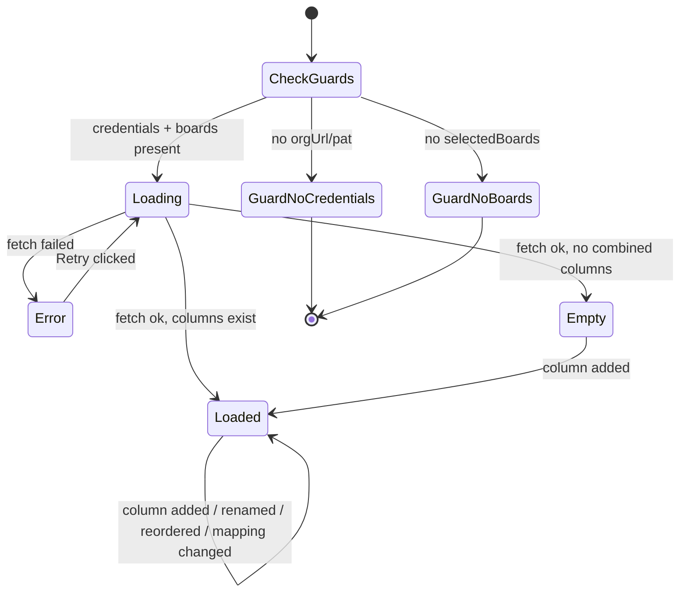
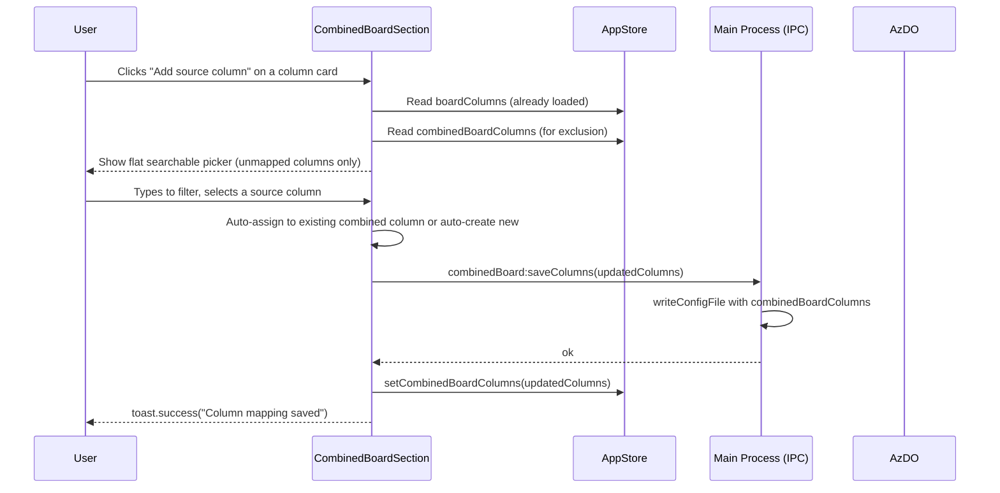
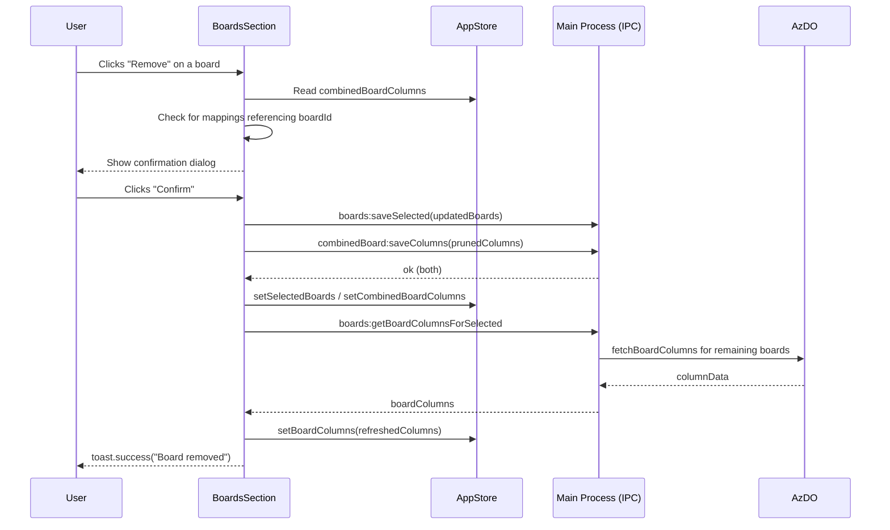

# Configure combined board

## Summary

A new "Combined Board" section in Settings allows users to define a set of named combined board columns and map one or more AzDO board columns from their selected remote boards into each combined column. These mappings will drive the Combined Board view (implemented separately). Combined columns support drag-and-drop reordering, inline renaming, and creation of empty columns. Adding a source column auto-creates a combined column if no column with that name already exists, or adds it to the matching existing combined column. Board column data is fetched eagerly from AzDO on app load and refreshes whenever the remote boards selection changes.

## Detailed description

### Settings section

The Settings sidebar (`SettingsPage.tsx`) gains a third entry: **Combined Board**, positioned after "Remote Boards". The section is guarded — if no AzDO connection is configured or no remote boards have been selected, the section renders a message:

> "Configure your connection and select at least one remote board before setting up the combined board."

The message includes a link/button to navigate to the relevant Settings section.

### Page layout

When guards pass, the Combined Board section renders:

- A **toolbar** at the top with an "Add column" button that creates a new empty combined board column.
- A **column list**: each combined board column displayed as a card, from top to bottom, in order. Cards support drag-and-drop reordering via `@dnd-kit/sortable` (same pattern as `BoardsSection.tsx`).
- Each **column card** contains:
  - A drag handle (left edge).
  - The column name — inline editable (click to edit, confirm on Enter/blur, cancel on Escape).
  - A list of source column mappings, each with a remove button.
  - An **"Add source column"** button that opens an inline searchable picker.
  - A **"Delete column"** button (with confirmation) to remove the combined column and all its mappings.

### Source column picker

Clicking "Add source column" on a combined column card opens a popover/inline search input. The picker presents a flat, searchable list of all `{projectName / boardName / columnName}` tuples fetched from AzDO for the selected boards. The list:

- Excludes columns already mapped to **any** combined column (a source column may only belong to one combined column).
- Filters case-insensitively by project name, board name, or column name as the user types.
- Shows a "No results" message when the search matches nothing.
- Closes on selection, on Escape, or on click-outside.

On selection, see **Auto-create / auto-assign logic** below.

### Auto-create / auto-assign logic

When the user selects a source column from the picker:

1. If a combined column whose name exactly matches the source column name (case-insensitive) **already exists** — add the source mapping to that combined column.
2. If **no** combined column with that name exists — create a new combined column with that name containing the source mapping.

When a user explicitly adds an empty column via "Add column", they are prompted for a name inline (auto-focused text input, confirmed on Enter/blur). If the name is empty on blur, the empty column is discarded. Duplicate names (case-insensitive) are not allowed and show an inline validation message.

### Persistence

All changes (add column, rename column, add mapping, remove mapping, remove column, reorder) persist immediately to `config.json` via a new IPC handler `combinedBoard:saveColumns`. No explicit Save button is needed. A `toast.success` confirms each write, consistent with `BoardsSection.tsx`.

### AzDO column fetch

A new function `fetchBoardColumns({ orgUrl, pat, selectedBoards })` in `azdo.ts` calls `WorkApi.getBoardColumns(teamContext, boardId)` for each selected board in parallel. It returns a flat array of `BoardColumnInfo` objects. Fetch is triggered:

1. **On app load** — from `App.tsx` (or a top-level hook), after settings are loaded from config and credentials are confirmed.
2. **When remote boards change** — after `saveSelectedBoards` completes in `BoardsSection.tsx`.

The fetched column data is stored in `appStore` and is not persisted to `config.json`.

### Board removal — cascading mapping removal

In the existing `BoardsSection.tsx`, the `handleRemove` function is updated:

1. Before removing, check the stored `combinedBoardColumns` from `appStore` for any mappings referencing the board being removed.
2. If mappings exist, show a confirmation dialog:
   > "Removing this board will also delete its column mappings in the Combined Board configuration. Do you want to continue?"
3. If the user confirms: remove the board from `selectedBoards` **and** remove all source mappings for that board from `combinedBoardColumns`, then save both.
4. If the user cancels: no changes are made.

The confirmation dialog is a small inline modal overlay (controlled via `useState`), consistent with the existing visual style.

### States

| State | Trigger | UI |
|---|---|---|
| Guard — no credentials | No `orgUrl`/`pat` in config | Message + link to Connection settings |
| Guard — no boards | `selectedBoards` is empty | Message + link to Remote Boards settings |
| Loading | Fetching AzDO columns | Spinner, list disabled |
| Error | AzDO column fetch failed | Error message + Retry button |
| Empty | Loaded, no combined columns yet | "No combined columns yet. Add a column or add a source column." + Add column button |
| Loaded | Columns and mappings present | Full column card list |

### Stale mapping detection

After fetching board columns, the renderer cross-references existing `combinedBoardColumns` source mappings against the fetched column IDs. Any mapping whose `boardId + columnId` is absent from the fetch results is considered stale. Stale mappings display a warning icon with the tooltip: "This source column could not be found. It may have been renamed or deleted in Azure DevOps."

Stale mappings are **not** automatically removed and remain until the user removes them manually.

## Data model

### New types

```typescript
interface BoardColumnInfo {
    boardId: string;
    boardName: string;
    projectId: string;
    projectName: string;
    columnId: string;
    columnName: string;
}

interface CombinedBoardColumnMapping {
    boardId: string;
    boardName: string;
    projectId: string;
    projectName: string;
    columnId: string;
    columnName: string;
}

interface CombinedBoardColumn {
    id: string;           // stable UUID, generated on creation
    name: string;         // user-defined display name
    sourceMappings: CombinedBoardColumnMapping[];
}
```

### `ConfigFile` extension

```typescript
interface ConfigFile {
    orgUrl?: string;
    encryptedPat?: string;
    selectedBoards?: SelectedBoard[];
    combinedBoardColumns?: CombinedBoardColumn[];   // ordered array
}
```

### `AppStore` additions

```typescript
interface AppState {
    // existing...
    boardColumns: BoardColumnInfo[];               // live, not persisted
    combinedBoardColumns: CombinedBoardColumn[];  // persisted via IPC
    setBoardColumns: (columns: BoardColumnInfo[]) => void;
    setCombinedBoardColumns: (columns: CombinedBoardColumn[]) => void;
}
```

## User stories

- *As a user, I want to define named combined board columns so that I can organise work items from multiple AzDO boards into a single consolidated view.*
- *As a user, I want source columns added automatically when I assign a column with a new name, so that I can build my mapping quickly without redundant steps.*
- *As a user, I want to rename and reorder combined columns so that the combined board reflects my workflow.*
- *As a user, I want to be warned before removing a remote board if it has column mappings, so that I do not accidentally lose configuration I have set up.*
- *As a user, I want stale source column mappings to be flagged visually so that I know when my configuration has drifted from AzDO.*

## Key decisions

| Decision | Outcome |
|---|---|
| Auto-create combined column on source add | If a combined column with that name already exists (case-insensitive), the source is added to it. Otherwise a new combined column is created automatically. |
| Source column picker — flat list | All board/column pairs from selected boards shown in a single searchable flat list, excluding already-mapped columns. |
| Empty combined columns allowed | Users may create empty combined columns and populate them later. |
| AzDO column fetch timing | Eager — on app load and whenever remote boards are updated. Stored in `appStore`, not persisted to `config.json`. |
| Board removal cascade | Removing a remote board that has combined column mappings shows a confirmation dialog. On confirm, mappings are pruned. On cancel, nothing changes. |
| Source column uniqueness | A source column (`boardId` + `columnId`) may only appear in one combined board column. The picker excludes already-mapped columns. |
| Scope — settings only | This feature covers Settings configuration of combined columns only. Rendering of work items in the Combined Board page is a separate feature. |
| Guard states | The Combined Board Settings section is disabled with a message if no credentials are configured or no remote boards are selected. |

## Validation

| Rule | Behaviour |
|---|---|
| Combined column name must not be empty | Discard empty column on blur; show inline message if submitted via Enter |
| Combined column name must be unique (case-insensitive) | Inline validation message: "A column with this name already exists." |
| Source column may only appear in one combined column | Already-mapped columns are excluded from the picker entirely |

## Diagrams

### Settings flow — Combined Board section states



### Sequence — adding a source column



### Sequence — removing a remote board with mappings



## Acceptance criteria

```gherkin
Feature: Configure combined board columns

  Background:
    Given the user has configured a valid AzDO connection
    And the user has selected at least one remote board
    And the remote boards have been loaded successfully

  # Guard states

  Scenario: No credentials configured
    Given the user has not configured an AzDO connection
    When the user navigates to Settings > Combined Board
    Then a message is displayed directing them to configure the connection first
    And the combined board configuration controls are not visible

  Scenario: No remote boards selected
    Given the user has not selected any remote boards
    When the user navigates to Settings > Combined Board
    Then a message is displayed indicating they must select remote boards first
    And the combined board configuration controls are not visible

  # Core column management

  Scenario: Add an empty combined column
    Given the Combined Board settings section is loaded
    When the user clicks "Add column"
    And types "Ready for Review" and presses Enter
    Then a new combined column named "Ready for Review" appears in the column list
    And it has no source mappings

  Scenario: Reject empty column name
    Given the Combined Board settings section is loaded
    When the user clicks "Add column"
    And leaves the name blank and presses Enter
    Then no column is added

  Scenario: Reject duplicate column name
    Given a combined column named "Backlog" already exists
    When the user clicks "Add column"
    And types "backlog" and presses Enter
    Then an inline message is shown: "A column with this name already exists."
    And no duplicate column is created

  Scenario: Rename a combined column
    Given a combined column named "In Flight" exists
    When the user clicks the column name to edit it
    And changes it to "In Progress" and presses Enter
    Then the column is renamed to "In Progress"
    And the change persists after navigating away and returning

  Scenario: Cancel rename on Escape
    Given a combined column named "In Progress" exists
    When the user clicks the column name to edit it
    And presses Escape without saving
    Then the column name reverts to "In Progress"

  Scenario: Reorder combined columns via drag and drop
    Given combined columns "Backlog", "In Progress", and "Done" exist in that order
    When the user drags "Done" to the top of the list
    Then the order becomes "Done", "Backlog", "In Progress"
    And the new order persists after navigating away and returning

  Scenario: Delete a combined column with no mappings
    Given a combined column "Done" exists with no source mappings
    When the user clicks "Delete column" on "Done"
    Then "Done" is removed from the column list with no confirmation dialog

  Scenario: Delete a combined column with mappings — confirm
    Given a combined column "Done" exists with one or more source mappings
    When the user clicks "Delete column" on "Done"
    Then a confirmation dialog is shown
    When the user confirms
    Then "Done" and all its source mappings are removed

  # Source column picker

  Scenario: Open source column picker
    Given a combined column "Backlog" exists
    When the user clicks "Add source column" on "Backlog"
    Then a searchable list appears showing all unmapped AzDO board columns
    And each entry is shown as "{projectName} / {boardName} / {columnName}"

  Scenario: Already-mapped columns excluded from picker
    Given source column "ProjectA / Stories / In Progress" is already mapped to combined column "In Progress"
    When the user opens the source column picker on any combined column
    Then "ProjectA / Stories / In Progress" does not appear in the picker list

  Scenario: Filter picker by search term
    Given the source column picker is open
    When the user types "backlog"
    Then only entries containing "backlog" in project name, board name, or column name are shown

  Scenario: Picker shows no-results message
    Given the source column picker is open
    When the user types a term that matches no columns
    Then the message "No results" is displayed

  Scenario: Close picker on Escape
    Given the source column picker is open
    When the user presses Escape
    Then the picker closes with no changes

  # Auto-create / auto-assign

  Scenario: Auto-assign source column to matching combined column
    Given a combined column named "Backlog" exists
    When the user selects a source column named "Backlog" from the picker on any combined column card
    Then the source column is added to the existing "Backlog" combined column

  Scenario: Auto-create combined column for new source column name
    Given no combined column named "In Progress" exists
    When the user selects a source column named "In Progress" from the picker
    Then a new combined column "In Progress" is created
    And the selected source column is added as its first mapping

  # Persistence

  Scenario: Changes persist immediately
    Given a combined column "Backlog" exists
    When the user adds a source column to "Backlog"
    Then a success toast is shown
    And after restarting the application the mapping is still present

  # Stale mappings

  Scenario: Stale source column mapping flagged
    Given a source column mapping exists for a column that no longer appears in AzDO
    When the Combined Board settings section loads
    Then the stale mapping displays a warning icon
    And hovering the icon shows: "This source column could not be found. It may have been renamed or deleted in Azure DevOps."

  # Board removal cascade

  Scenario: Remove a board with no column mappings
    Given a remote board has no combined column mappings
    When the user removes that board in Settings > Remote Boards
    Then the board is removed with no confirmation dialog

  Scenario: Remove a board with column mappings — confirm
    Given a remote board has one or more combined column mappings
    When the user clicks "Remove" on that board in Settings > Remote Boards
    Then a confirmation dialog is shown: "Removing this board will also delete its column mappings in the Combined Board configuration. Do you want to continue?"
    When the user clicks "Confirm"
    Then the board is removed from selected boards
    And all source column mappings referencing that board are removed from combined board columns
    And a success toast is shown

  Scenario: Remove a board with column mappings — cancel
    Given a remote board has one or more combined column mappings
    When the user clicks "Remove" on that board in Settings > Remote Boards
    And a confirmation dialog appears
    When the user clicks "Cancel"
    Then the board remains in the selected boards list
    And all combined column mappings are unchanged

  # Column data refresh

  Scenario: Columns fetched on app load
    Given the app has credentials and selected boards configured
    When the app starts
    Then board columns are fetched from AzDO automatically
    And the Combined Board settings section shows the up-to-date available column list

  Scenario: Columns refreshed after remote boards change
    Given the user adds or removes a remote board in Settings > Remote Boards
    When the change is saved
    Then the available board columns are refreshed from AzDO
```

## Manual test steps

> Prerequisites: A valid AzDO organisation URL and PAT configured. At least two remote boards selected in Settings > Remote Boards. The boards should have columns with differing names to exercise both auto-create and auto-assign.

### Guard states

1. Open the app with no AzDO credentials configured. Navigate to Settings > Combined Board. Verify a message appears directing you to configure the connection first, and no column list is shown.
2. Configure credentials but remove all remote boards. Navigate to Settings > Combined Board. Verify a message appears directing you to select remote boards first.

### Loading

3. With credentials and boards configured, navigate to Settings > Combined Board. Verify a loading indicator appears briefly then the column list (or empty-state message) is shown.

### Adding an empty column

4. Click "Add column". Verify an inline text input appears. Type "My Column" and press Enter. Verify the column appears in the list with no source mappings.
5. Click "Add column" again. Leave the field blank and press Enter. Verify no empty column is added.
6. Click "Add column". Type "my column" (lowercase). Press Enter. Verify an inline validation message appears about a duplicate name and no second column is created.

### Renaming a column

7. Click the name of an existing combined column. Verify it becomes editable. Change the name to "Renamed Column" and press Enter. Verify the new name is displayed.
8. Click the name again, make a change, then press Escape. Verify the name reverts.

### Reordering columns

9. With at least two combined columns, drag one using its handle to a different position. Verify the order changes visually. Navigate away and back. Verify the new order persists.

### Adding a source column — auto-assign

10. Create (or rename) a combined column to match a known AzDO column name (e.g. "Backlog").
11. On a different combined column card, click "Add source column". In the picker, locate and select an AzDO column named "Backlog". Verify it is added to the existing "Backlog" combined column, not the card you clicked.

### Adding a source column — auto-create

12. On any combined column card, click "Add source column". Select a column whose name does not match any existing combined column. Verify a new combined column with that name is created containing the source mapping.

### Picker search and exclusion

13. Open any source column picker. Verify entries are shown as `{Project} / {Board} / {Column}`. Type part of a project name and verify the list filters. Clear the search and verify all unmapped columns reappear.
14. Verify that columns already mapped to any combined column do not appear in the picker.
15. Type a term matching nothing. Verify a "No results" message is shown.
16. Press Escape. Verify the picker closes with no changes.

### Stale mapping warning

17. Map a source column from a remote board. Go to Settings > Remote Boards and remove that board (confirm the cascade dialog). Go to Settings > Combined Board. Verify the now-unmappable entry shows a warning icon with the appropriate tooltip.

### Board removal cascade

18. Ensure at least one source column from a specific board is mapped in a combined column. Go to Settings > Remote Boards and click "Remove" on that board. Verify a confirmation dialog appears. Click "Cancel". Verify the board and mappings remain.
19. Click "Remove" again and click "Confirm". Verify the board is removed, and in Settings > Combined Board the source mapping for that board is gone.
20. Remove a board that has no column mappings. Verify no confirmation dialog appears.

### Delete a combined column

21. Click "Delete column" on a combined column with no source mappings. Verify it is removed immediately with no dialog.
22. Add a source mapping to a combined column then click "Delete column". Verify a confirmation dialog appears. Confirm. Verify the column and its mappings are removed.

### Persistence across restart

23. Create a combined column, add a source mapping, and reorder columns. Close and reopen the app. Verify all changes are preserved.

## Implementation tasks

> Tasks are ordered by dependency. Each builds on the previous.

### 1. New shared types
**File:** `src/shared/electronAPI.ts`

Add `BoardColumnInfo`, `CombinedBoardColumnMapping`, and `CombinedBoardColumn` interfaces. Add new IPC methods to `ElectronAPI`: `getBoardColumnsForSelected`, `loadCombinedBoardColumns`, `saveCombinedBoardColumns`.

### 2. Config functions
**File:** `src/config.ts`

Add:
- `loadCombinedBoardColumns(): CombinedBoardColumn[]` — reads `combinedBoardColumns` from `config.json`, defaulting to `[]`.
- `saveCombinedBoardColumns(columns: CombinedBoardColumn[]): void` — writes to `config.json`.

Pattern: follow the `loadSelectedBoards` / `saveSelectedBoards` functions in the same file.

### 3. AzDO column fetch
**File:** `src/azdo.ts`

Add `fetchBoardColumns({ orgUrl, pat, selectedBoards: SelectedBoard[] }): Promise<BoardColumnInfo[]>`.
For each selected board call `WorkApi.getBoardColumns({ project: board.projectName, team: board.teamName }, board.boardId)`. Collect results with `Promise.all` (same pattern as `fetchAvailableBoards`). Return a flat array. Handle per-board errors gracefully — log and skip, matching the existing pattern.

### 4. IPC handlers
**File:** `src/main.ts`

Add handlers following the existing style:
- `ipcMain.handle("boards:getBoardColumnsForSelected", async () => { ... })` — calls `fetchBoardColumns` with config + `loadSelectedBoards()`, returns `{ columns }` or `{ error }`.
- `ipcMain.handle("combinedBoard:loadColumns", () => loadCombinedBoardColumns())`.
- `ipcMain.handle("combinedBoard:saveColumns", (_, columns) => saveCombinedBoardColumns(columns))`.

### 5. Preload bridge
**File:** `src/preload.ts`

Expose the three new IPC methods on the `api` object, following the existing pattern.

### 6. App store
**File:** `src/renderer/store/appStore.ts`

Add `boardColumns: BoardColumnInfo[]`, `combinedBoardColumns: CombinedBoardColumn[]`, `setBoardColumns`, and `setCombinedBoardColumns` to the Zustand store. Follow the `selectedBoards` / `setSelectedBoards` pattern.

### 7. Eager column fetch
**File:** `src/renderer/App.tsx` (or a new `src/renderer/hooks/useBoardColumns.ts`)

On mount, call `window.electron.getBoardColumnsForSelected()` and `window.electron.loadCombinedBoardColumns()`, then push results to the store. Re-run the column fetch when `selectedBoards` changes in the store (via `useEffect`).

### 8. Board removal cascade — confirmation dialog
**File:** `src/renderer/components/Settings/BoardsSection.tsx`

Update `handleRemove(boardId)`:
1. Read `combinedBoardColumns` from `appStore`.
2. Check for any mappings referencing `boardId`.
3. If found, set a `pendingRemoveBoardId` state to show a small modal overlay (controlled via `useState`).
4. On confirm: remove the board via the existing `updateSelected` path, prune combined column mappings via `window.electron.saveCombinedBoardColumns`, update the store, then refresh board columns.
5. If the board has no mappings, remove immediately (existing behaviour).

### 9. Settings sidebar entry
**File:** `src/renderer/pages/SettingsPage.tsx`

Add `{ id: "combined-board", label: "Combined Board" }` to the `sections` array. Add a conditional render block for `<CombinedBoardSection />` in the content area.

### 10. CombinedBoardSection component
**File:** `src/renderer/components/Settings/CombinedBoardSection.tsx` (new file)

Implement the full Combined Board settings UI:
- Guard state rendering (no credentials, no boards).
- Column card list with `@dnd-kit/sortable` drag-and-drop, following `BoardsSection.tsx` exactly.
- Inline editable column name (click to edit, Enter/blur to save, Escape to cancel).
- Source column picker (inline search input + filtered flat list, closes on Escape/click-outside).
- Auto-create / auto-assign logic on source column selection (extract as a pure function for testability).
- Add empty column flow.
- Delete column with confirmation modal.
- Stale mapping warning icon and tooltip, following the stale board pattern in `BoardsSection.tsx`.
- Persistence on every change via `window.electron.saveCombinedBoardColumns` with `toast.success`.

### 11. Tests
**Files:** `src/renderer/components/Settings/CombinedBoardSection.test.ts`, `src/config.test.ts` (extend), `src/azdo.test.ts` (extend)

Cover with Vitest:
- Auto-create vs auto-assign logic (pure function extracted from component).
- Duplicate name validation.
- Source column exclusion from picker (already-mapped columns filtered out).
- `loadCombinedBoardColumns` / `saveCombinedBoardColumns` in `config.ts`.
- `fetchBoardColumns` in `azdo.ts` (mock the AzDO API client).