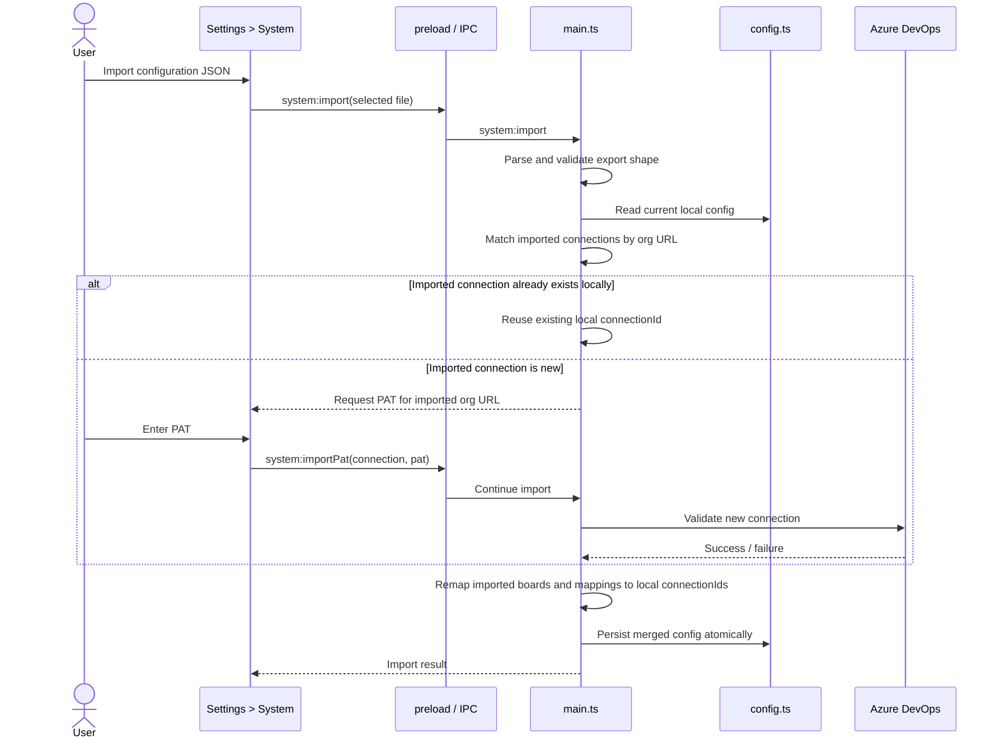
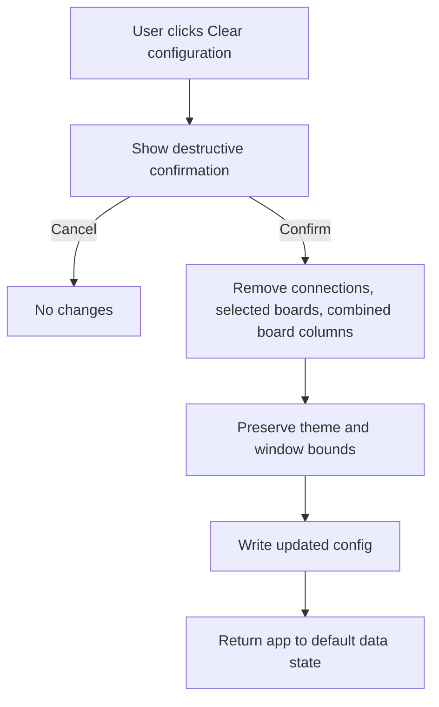

# Import, Export, and Clear Configuration

## Summary

Lizzie should add a Settings → System area where users can export the current application configuration to JSON, import that JSON back into another Lizzie instance, and clear the current application data. Exported files must never include PATs. When importing, Lizzie must prompt for a PAT for each imported connection that does not already exist locally, then merge the imported boards and combined-board mappings into the current configuration using organization URL matching to reconnect imported data to existing local connections.

## Detailed description

Lizzie currently stores configuration locally in a single JSON file and already separates connection metadata from selected boards, combined-board column mappings, theme, and window bounds. This feature adds controlled file-based portability and reset operations without exposing secrets.

The Settings screen must gain a new System section. That section must present three user actions: Export configuration, Import configuration, and Clear configuration. These actions should be grouped as system-level actions rather than board or connection management actions because they operate on the entire application state.

### Export configuration

Export must generate a shareable JSON representation of the current configuration. The export must include:

- Connections without PATs or encrypted PATs
- Selected boards
- Combined-board columns and their source mappings

Export must not include:

- PATs in any form
- Encrypted PATs
- Window bounds
- Theme preference

The exported document must preserve stable references needed for later import. In practice, the export format must include enough connection metadata to match imported references back to a local connection, with organization URL being the authoritative merge key. The exported file should be human-readable JSON so users can store it in source control or share it securely inside their team without leaking credentials.

### Import configuration

Import must accept a previously exported JSON file. Lizzie must validate that the file structure is compatible before writing any changes to local config.

Imported data merges into the current local configuration rather than replacing it. Merge behavior must follow these rules:

- Connections are matched by organization URL, case-insensitively.
- If an imported connection matches an existing local connection URL, Lizzie must reuse the existing local connection and link imported boards and combined-board mappings to that existing connection.
- If an imported connection does not exist locally, Lizzie must prompt the user for a PAT before the import completes.
- New connections created from import must be validated against Azure DevOps before they are saved.
- Imported selected boards must be merged with existing selected boards, skipping duplicates.
- Imported combined-board columns must be merged with existing combined-board columns, preserving source mapping identity by `connectionId + boardId + columnId` after imported references are remapped to local connections.

Import is not allowed to create half-configured state. If the import file references a new organization URL, the user must provide a PAT for it before the import can finish successfully. A cancelled or failed PAT step must leave the current local configuration unchanged.

Because connection IDs are local implementation details, import cannot blindly trust connection IDs from the file. Imported boards and mappings must be remapped from imported connection records to local connection records using matched or newly created local connection IDs.

### Duplicate handling during import

The feature must merge rather than duplicate. Duplicate detection rules should follow the existing identity model already used elsewhere in Lizzie:

- Connections: organization URL, case-insensitive
- Selected boards: `connectionId + boardId`
- Combined-board source mappings: `connectionId + boardId + columnId`
- Combined-board columns: existing column identity should be preserved; if the same imported source mapping already exists in a local combined column, it must not be added again

If an imported combined-board column contains a source mapping that already exists locally under a different column, the import must keep the existing local mapping placement rather than duplicating that mapping into a second combined column. This avoids creating ambiguous combined-board state.

### Clear configuration

Clear configuration must remove application data and return Lizzie to its default data state while preserving user environment preferences that are not considered shareable config.

Clear must remove:

- Connections
- Selected boards
- Combined-board columns and mappings

Clear must preserve:

- Theme preference
- Window bounds

After clear completes, Lizzie should behave like a fresh install from a data perspective. Combined Board guard states should direct the user back to Settings to add a connection again. Clearing configuration must require explicit confirmation because it is destructive.

### Error handling and atomicity

Import and clear operations must be atomic from the user’s perspective. Lizzie must not partially write config if validation fails, if required PAT entry is cancelled, or if a newly introduced connection cannot be validated. Export must fail gracefully if the destination file cannot be written. Import must fail gracefully if the file is unreadable, malformed JSON, or not in the expected Lizzie export format.

## User stories

- As a user, I want to export Lizzie configuration without PATs so that I can share board setup safely between machines or teammates.
- As a user, I want to import a previously exported config so that I can restore boards and combined-board mappings quickly.
- As a user, I want imported connections to match existing local connections by organization URL so that I do not create duplicate organizations accidentally.
- As a user, I want Lizzie to prompt for PATs only when an imported connection is new so that secure data stays local but setup is still efficient.
- As a user, I want to clear stored data without losing my theme or window layout so that I can reset the app while keeping my local preferences.

## Key decisions

| Decision | Outcome |
|----------|---------|
| Settings placement | Add a new Settings → System section for import/export/clear actions. |
| Export scope | Export shareable config only: connections without PATs, selected boards, combined-board columns, and theme. |
| Secret handling | PATs and encrypted PATs are never exported. |
| Merge model | Import merges into current config rather than replacing it. |
| Connection matching | Connections match by organization URL, case-insensitively. |
| PAT capture | New imported connections must collect a PAT before import can complete. No incomplete imported connections are allowed. |
| Import validation | New imported connections must be validated before save, and failed or cancelled imports must not partially apply. |
| Clear scope | Clear removes connections, selected boards, and combined-board setup, but preserves theme and window bounds. |

## Validation

| Rule | Error message |
| ---- | ------------- |
| Imported file must be readable. | Could not read the selected configuration file. |
| Imported file must be valid JSON. | The selected file is not valid JSON. |
| Imported file must match Lizzie's expected export shape. | The selected file is not a valid Lizzie configuration export. |
| Imported connection URLs must be valid HTTPS URLs. | One or more imported connections have an invalid organisation URL. |
| A PAT is required for each imported connection that does not already exist locally. | A Personal Access Token is required to import this connection. |
| New imported connections must pass Azure DevOps validation before save. | Could not connect to Azure DevOps. Check your PAT and try again. |
| Export must succeed in writing the file. | Could not export configuration to the selected location. |
| Clear must require explicit confirmation. | Clearing configuration cannot proceed without confirmation. |

## Diagrams





## Acceptance criteria

```gherkin
Feature: Exporting Lizzie configuration

  Scenario: Export shareable configuration
    Given the user has configured connections, selected boards, and combined-board columns
    When the user exports configuration from Settings > System
    Then Lizzie writes a JSON file containing shareable configuration
    And the file includes connection metadata without PATs
    And the file includes selected boards
    And the file includes combined-board columns and mappings
    And the file does not include PATs, encrypted PATs, or window bounds

  Scenario: Export fails because the destination cannot be written
    Given the user is exporting configuration
    When Lizzie cannot write the file
    Then the export is aborted
    And the user sees an export failure message

Feature: Importing Lizzie configuration

  Scenario: Import a valid export that matches an existing local connection
    Given the user already has a local connection for https://dev.azure.com/example-org
    And the imported file contains a connection for https://dev.azure.com/example-org
    When the user imports the file
    Then Lizzie reuses the existing local connection
    And imported boards are linked to that local connection
    And imported combined-board mappings are linked to that local connection
    And no PAT prompt is shown for that connection

  Scenario: Import a valid export with a new connection
    Given the imported file contains a connection that does not exist locally
    When the user imports the file
    Then Lizzie prompts for a PAT for that connection
    And Lizzie validates the PAT before completing import
    And on success Lizzie creates the connection and merges the imported data

  Scenario: Cancel PAT entry during import
    Given the imported file contains a new connection
    When the user cancels PAT entry
    Then the import does not complete
    And the local configuration remains unchanged

  Scenario: Imported file is malformed
    Given the user selects a malformed or incompatible file
    When the user starts import
    Then Lizzie rejects the import
    And the local configuration remains unchanged
    And the user sees an import validation error

  Scenario: Import merges without duplicating boards or mappings
    Given the current local config already contains some of the same boards and source mappings as the imported file
    When the user imports the file
    Then Lizzie merges the imported data into the existing config
    And duplicate boards are not added twice
    And duplicate source mappings are not added twice

  Scenario: Imported mapping already exists in a local combined column
    Given the imported file contains a source mapping that already exists locally
    When the user imports the file
    Then Lizzie keeps the existing local mapping placement
    And Lizzie does not duplicate that mapping into another combined column

Feature: Clearing Lizzie configuration

  Scenario: Clear stored data
    Given the user has configured connections, boards, and combined-board columns
    When the user confirms Clear configuration from Settings > System
    Then Lizzie removes connections, selected boards, and combined-board columns
    And Lizzie preserves theme preference
    And Lizzie preserves window bounds
    And the app returns to its default data state

  Scenario: Cancel clear configuration
    Given the user starts the Clear configuration flow
    When the user cancels the confirmation
    Then no configuration data is removed
```

## Manual test steps

1. Open Settings and verify a new System section is available.
2. Configure at least one connection, select boards, and create combined-board mappings.
3. Change the theme so the export contains a visible preference.
4. Export configuration from Settings → System to a JSON file.
5. Open the exported JSON and verify it contains connection names and URLs, selected boards, combined-board columns, but no PAT or encrypted PAT values.
6. On the same machine or a second Lizzie instance, ensure at least one imported organization URL already exists locally.
7. Import the exported file and verify the existing local connection is reused without prompting for a PAT.
8. Verify imported boards and combined-board mappings appear and are linked to the existing local connection.
9. Repeat the import on a Lizzie instance that does not yet have one of the imported organization URLs.
10. Verify Lizzie prompts for a PAT for the missing organization before finishing import.
11. Enter a valid PAT and verify the new connection is created and the imported boards and mappings appear.
12. Repeat the import and cancel PAT entry; verify no partial configuration is applied.
13. Attempt to import an invalid JSON file and verify Lizzie rejects it with an error.
14. Use Clear configuration from Settings → System.
15. Cancel the confirmation once and verify nothing changes.
16. Confirm the clear action and verify connections, selected boards, and combined-board columns are removed.
17. Verify the theme and window layout behavior remain as they were before clearing.

## Implementation tasks

1. Extend the config layer in [src/config.ts](/Users/bec/development/sixpivot/lizzie/src/config.ts) and [src/config.test.ts](/Users/bec/development/sixpivot/lizzie/src/config.test.ts) with explicit import/export/reset helpers. Keep `ConfigFile` as the persistence source of truth, add a safe export shape that excludes secret fields, and add atomic merge and clear operations that preserve theme and window bounds.
2. Define typed import/export IPC contracts in [src/shared/electronAPI.ts](/Users/bec/development/sixpivot/lizzie/src/shared/electronAPI.ts) and expose them in [src/preload.ts](/Users/bec/development/sixpivot/lizzie/src/preload.ts). The renderer should receive typed success, validation, and PAT-prompt responses rather than reimplementing config logic client-side.
3. Implement the main-process orchestration in [src/main.ts](/Users/bec/development/sixpivot/lizzie/src/main.ts). Add handlers for export, import, and clear; perform file reading and writing there; validate import payloads; prompt for PATs through a renderer flow; and keep the final config write atomic.
4. Reuse Azure DevOps validation patterns from [src/azdo.ts](/Users/bec/development/sixpivot/lizzie/src/azdo.ts) and expand [src/azdo.test.ts](/Users/bec/development/sixpivot/lizzie/src/azdo.test.ts) only if new validation helpers are needed for imported connections. New imported connections should go through the same PAT validation path as manually added ones.
5. Add a new System section to the Settings navigation in [src/renderer/pages/SettingsPage.tsx](/Users/bec/development/sixpivot/lizzie/src/renderer/pages/SettingsPage.tsx), following the existing section-switching pattern used for Appearance, Connection, Remote Boards, and Combined Board.
6. Create a renderer component for the System UI under [src/renderer/components/Settings]( /Users/bec/development/sixpivot/lizzie/src/renderer/components/Settings ) that follows the existing settings-section patterns seen in [src/renderer/components/Settings/AppearanceSection.tsx](/Users/bec/development/sixpivot/lizzie/src/renderer/components/Settings/AppearanceSection.tsx) and [src/renderer/components/Settings/ConnectionSection.tsx](/Users/bec/development/sixpivot/lizzie/src/renderer/components/Settings/ConnectionSection.tsx). It should handle export, import file selection, PAT prompts for new connections, destructive clear confirmation, and user feedback.
7. Ensure renderer state in [src/renderer/store/appStore.ts](/Users/bec/development/sixpivot/lizzie/src/renderer/store/appStore.ts) and startup loading in [src/renderer/App.tsx](/Users/bec/development/sixpivot/lizzie/src/renderer/App.tsx) stay coherent after import and clear. Imported data must refresh the active store state immediately, and clear must return board-related state to empty while preserving theme.
8. Add targeted tests for import/export/reset behavior. At minimum, cover config merge rules in [src/config.test.ts](/Users/bec/development/sixpivot/lizzie/src/config.test.ts) and add renderer or pure-helper tests for any new mapping-remap logic under [src/renderer/components/Settings]( /Users/bec/development/sixpivot/lizzie/src/renderer/components/Settings ) or [src/renderer/pages]( /Users/bec/development/sixpivot/lizzie/src/renderer/pages ).