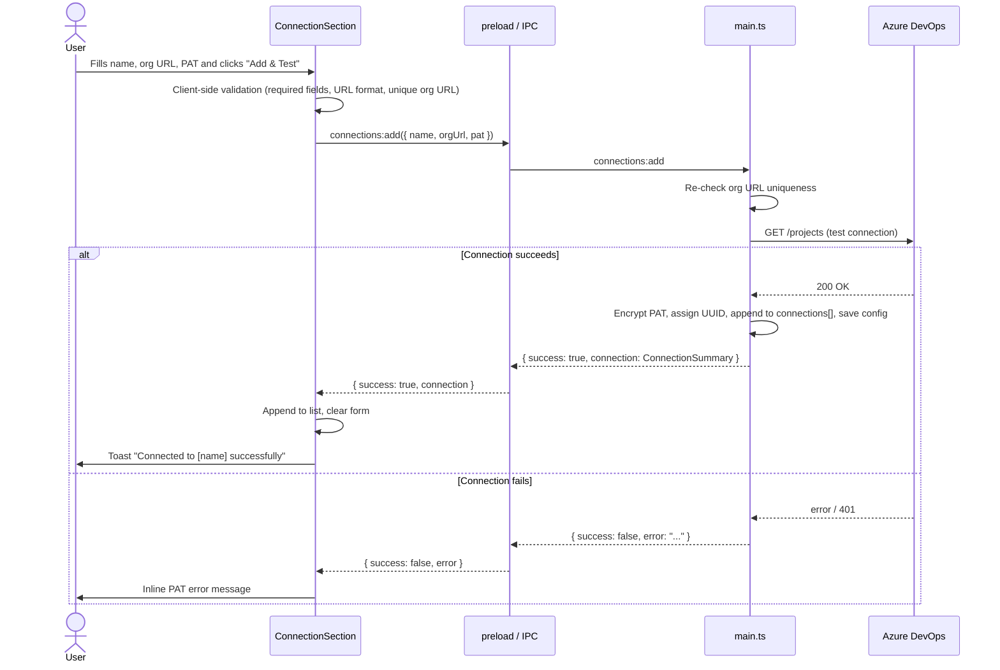
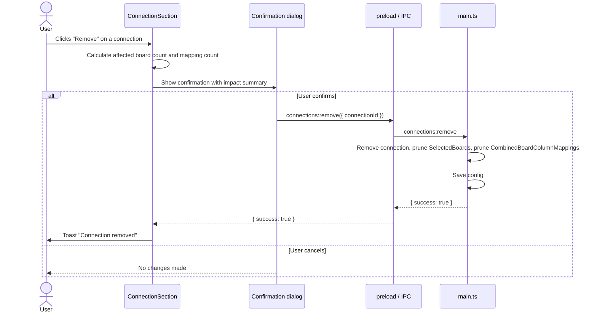
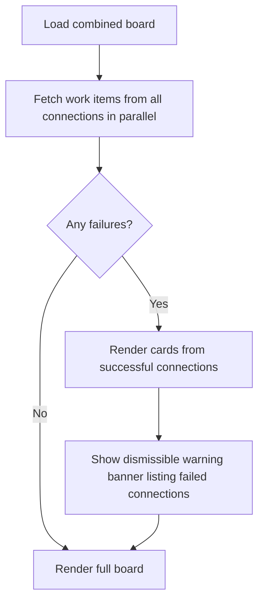

# Multiple AzDO connections - combine boards across connections

https://github.com/SixPivot/lizzie/issues/1

## Summary

Extend Lizzie to support multiple Azure DevOps (AzDO) connections — each with a friendly name, organisation URL, and Personal Access Token (PAT). Board selection and the combined board view work across all configured connections simultaneously. Boards and column mappings are attributed to their originating connection so that adding, removing, or re-testing a connection is reflected cleanly throughout the app.

## Detailed description

### Connection management (Settings > Connections)

The Connections section displays a list of saved connections. Each connection shows:
- Its friendly display name
- Its organisation URL
- Its PAT (masked, not editable inline)
- A **Re-test** button and a **Remove** button

Below the list, an "Add connection" form allows the user to enter a name, organisation URL, and PAT, then click **Add & Test** to validate and save.

**Adding a connection:**
- All three fields (name, org URL, PAT) are required.
- The org URL must be a well-formed HTTPS URL.
- The org URL must be unique across existing connections (case-insensitive comparison). Attempting to add a duplicate org URL shows an inline validation error and blocks submission.
- The PAT is tested against the AzDO API (`GET /projects`) before the connection is saved. If the test fails, the connection is not saved and an inline error is displayed.
- On success, the connection is appended to the list, a success toast is shown, and the "Add connection" form is cleared ready for another entry.

**Re-testing a connection:**
- Clicking **Re-test** on an existing connection invokes the AzDO API with the stored credentials.
- A spinner is shown on that row during the test.
- Success: a success toast appears; the row shows a green "healthy" indicator.
- Failure: an error toast appears; the row shows a red "failed" indicator.
- The healthy/failed indicator is session-only (not persisted to config).

**Removing a connection:**
- Clicking **Remove** shows a confirmation dialog. The dialog states the connection name and lists how many selected boards and combined board column mappings will also be deleted (e.g. "Removing 'Client A' will also remove 2 selected boards and 3 column mappings. This cannot be undone.").
- On confirmation: the connection is deleted from config; all `SelectedBoard` entries with that `connectionId` are removed; all `CombinedBoardColumnMapping` entries referencing those boards are removed from every combined column. Combined columns that still have at least one remaining mapping are retained. The config is saved atomically and a success toast is shown.
- On cancellation: no changes are made.
- There is no cap on the number of connections.

### Board selection (Settings > Boards)

Available boards are fetched from all configured connections in parallel. In the available boards panel, boards are grouped under their connection's friendly name as a collapsible section header. A `connectionId` is stored on each `SelectedBoard` entry so that boards from different orgs are unambiguous, even if they share identical project or board names.

### Combined board

When the combined board loads, work items are fetched from all configured connections in parallel. If one or more connections fail (expired PAT, unreachable org, network error), the board renders the cards from the successful connections only. A dismissible warning banner appears at the top of the board naming the connections that failed, with a suggestion to re-test them in Settings.

Stale detection for combined board column mappings uses `connectionId + boardId + columnId` as the composite key, ensuring that identically-named boards in different organisations do not falsely validate each other's mappings.

### Config migration (startup)

On first launch after upgrade, if the config file contains a legacy top-level `orgUrl` and `encryptedPat` but no `connections` array, the app automatically:
1. Creates a new connection with `id` = generated UUID, `name` = `"Connection 1"`, and the legacy values.
2. Writes the `connections` array to config.
3. Removes the legacy `orgUrl` and `encryptedPat` top-level fields.

Migration is silent — no user prompt or restart required. Existing selected boards and combined board column configuration are preserved; their `connectionId` is set to the migrated connection's ID.

## User stories

- As a developer working across multiple clients, I want to add connections to several AzDO organisations so that I can track work items from all of them in a single Lizzie view.
- As a user, I want to give each connection a recognisable name so that I can tell them apart when selecting boards and diagnosing issues.
- As a user, I want to re-test a connection's PAT without removing and re-adding it so that I can quickly verify connectivity after a PAT rotation.
- As a user, I want a clear warning when one connection is unavailable so that the combined board still shows me the cards I can access.
- As an existing user upgrading from the single-connection version, I want my current connection preserved automatically so that I do not have to reconfigure anything.

## Key decisions

| Decision | Outcome |
|---|---|
| Friendly name per connection | Yes. Each connection has a user-supplied display name used throughout the UI. |
| Connection management UI pattern | Simple add/remove list. No drag-to-reorder. |
| Connection testing | Each connection is individually tested on add. A Re-test button is available per connection at any time. |
| Partial failure in combined board | The board renders cards from healthy connections. A dismissible banner names failed connections. No hard error. |
| Config migration | On first launch post-upgrade, the legacy single `orgUrl`/`encryptedPat` is automatically migrated to a connection named "Connection 1". |
| Org URL uniqueness | Enforced. Attempting to add a duplicate org URL (case-insensitive) is blocked with an inline error. |
| Board grouping | Boards in the Boards section are grouped by connection friendly name. |
| Cascade on connection removal | Confirmation dialog shows impact count. On confirm: connection, its selected boards, and its column mappings are all removed. Empty combined columns are retained. |
| Max connections | Unbounded. |

## Requirements

- Manage multiple connections, each with a name, org URL, and PAT.
- Each connection can be individually added (with a live test), re-tested, and removed.
- Org URLs are unique across connections (case-insensitive).
- Removing a connection shows a confirmation dialog and cascades removal to selected boards and combined board column mappings.
- Boards in the Boards section are grouped by connection.
- The combined board fetches from all connections in parallel; partial failures render a warning banner but do not halt the board.
- Combined board stale detection uses `connectionId + boardId + columnId` as the composite key.
- On first launch after upgrade, legacy single-connection config is auto-migrated to a connection named "Connection 1".

## Input validation

| Field | Rule | Error message |
|---|---|---|
| Connection name | Required, non-empty after trim | "Connection name is required." |
| Organisation URL | Required, non-empty after trim | "Organisation URL is required." |
| Organisation URL | Must be a valid HTTPS URL | "Organisation URL must be a valid URL (e.g. https://dev.azure.com/your-org)." |
| Organisation URL | Must be unique across existing connections (case-insensitive) | "A connection to this organisation already exists." |
| PAT | Required, non-empty after trim | "Personal Access Token is required." |
| PAT | Must pass live AzDO API test before save | "Could not connect to Azure DevOps. Check your PAT and try again." |

## Diagrams

### Add connection flow



### Remove connection flow



### Combined board partial failure



## Acceptance criteria

```gherkin
Feature: Managing multiple AzDO connections

  Scenario: Adding a valid new connection
    Given the user is on the Settings > Connections page
    When the user enters a unique name, a valid org URL, and a working PAT
    And clicks "Add & Test"
    Then the connection appears in the connections list
    And a success toast "Connected to [name] successfully" is shown
    And the add connection form is cleared

  Scenario: Adding a connection with a duplicate org URL
    Given a connection to "https://dev.azure.com/my-org" already exists
    When the user attempts to add another connection with the same org URL (any case)
    Then an inline error "A connection to this organisation already exists." is shown
    And the connection is not saved

  Scenario: Adding a connection with an invalid PAT
    Given the user enters a valid name, a unique org URL, and an invalid PAT
    When the user clicks "Add & Test"
    Then an inline error "Could not connect to Azure DevOps. Check your PAT and try again." is shown
    And the connection is not saved

  Scenario: Adding a connection with missing fields
    Given the user leaves the connection name blank
    When the user clicks "Add & Test"
    Then an inline error "Connection name is required." is shown
    And form submission is blocked

  Scenario: Re-testing a healthy connection
    Given a saved connection exists with valid credentials
    When the user clicks "Re-test" on that connection
    Then a spinner appears on that connection row during the test
    And on success a success toast is shown
    And a green healthy indicator appears on the connection row

  Scenario: Re-testing a failed connection
    Given a saved connection exists with an expired PAT
    When the user clicks "Re-test" on that connection
    Then a spinner appears on that connection row during the test
    And on failure an error toast is shown
    And a red failed indicator appears on the connection row

  Scenario: Removing a connection with no boards or mappings
    Given a saved connection exists with no selected boards and no column mappings
    When the user clicks "Remove" on that connection
    Then a confirmation dialog appears stating "0 selected boards and 0 column mappings will be removed"
    When the user confirms
    Then the connection is removed from the list
    And a success toast "Connection removed" is shown

  Scenario: Removing a connection with boards and mappings (confirmed)
    Given a saved connection "Client A" has 2 selected boards and 3 column mappings
    When the user clicks "Remove" on "Client A"
    Then a confirmation dialog lists the impact: "Removing 'Client A' will also remove 2 selected boards and 3 column mappings."
    When the user confirms
    Then "Client A" is removed from the connections list
    And its 2 selected boards are removed from the selected boards list
    And its 3 column mappings are removed from the combined board configuration
    And a success toast "Connection removed" is shown

  Scenario: Removing a connection (cancelled)
    Given a saved connection exists
    When the user clicks "Remove" and then cancels the confirmation dialog
    Then the connection remains in the list
    And no boards or mappings are changed

Feature: Legacy config migration

  Scenario: App starts with a legacy single-connection config
    Given the config file contains a top-level orgUrl and encryptedPat but no connections array
    When the application starts
    Then a connection named "Connection 1" is created with those credentials
    And the connections array is saved to config
    And the legacy orgUrl and encryptedPat top-level fields are removed
    And the user sees their existing boards and combined board configuration unchanged

  Scenario: App starts with no prior config
    Given no config file exists
    When the application starts
    Then the connections list is empty
    And the user is prompted to add a connection

Feature: Board selection with multiple connections

  Scenario: Available boards are grouped by connection
    Given two connections "Client A" and "Client B" are configured
    When the user opens Settings > Boards
    Then available boards are displayed under a "Client A" section header and a "Client B" section header

  Scenario: Boards from a removed connection are deselected
    Given "Client A" has board "Stories" selected
    When "Client A" is removed (confirmed)
    Then "Stories" from "Client A" no longer appears in the selected boards list

Feature: Combined board with multiple connections

  Scenario: All connections healthy
    Given two connections are configured and both respond successfully
    When the combined board is opened
    Then work items from both connections are displayed
    And no warning banner is shown

  Scenario: One connection fails during fetch
    Given two connections are configured and one returns an error during work item fetch
    When the combined board is opened
    Then work items from the healthy connection are displayed
    And a dismissible warning banner names the failed connection
    And the banner suggests re-testing the connection in Settings

  Scenario: All connections fail during fetch
    Given all connections fail during work item fetch
    When the combined board is opened
    Then no work item cards are shown
    And a warning banner lists all failed connections

  Scenario: Stale mapping detection distinguishes connections
    Given two connections each have a board with the same boardId
    And a column mapping references boardId from connection A
    When the boards from connection B are fetched but not connection A
    Then the column mapping for connection A is flagged as stale
    And the column mapping for connection B (if present) is not affected
```

## Manual test steps

### Setup
1. Open Lizzie. Confirm the Settings > Connections section shows a list (or is empty if freshly installed).

### Migration (if upgrading from single-connection version)
2. Launch the app with a pre-existing `config.json` containing `orgUrl` and `encryptedPat` (but no `connections` array).
3. Navigate to Settings > Connections.
4. Confirm a connection named "Connection 1" appears with the correct org URL.
5. Confirm your previously selected boards and combined board configuration are intact.

### Adding a connection
6. In the "Add connection" form, enter a friendly name (e.g. "My Company"), a valid org URL, and a valid PAT. Click "Add & Test".
7. Confirm a success toast appears and "My Company" appears in the connections list.
8. Confirm the form is cleared.
9. Try to add a second connection using the **same org URL** (try with different letter casing). Confirm the inline error "A connection to this organisation already exists." is shown.
10. Add a second connection with a different org URL but an **invalid PAT**. Confirm the inline error "Could not connect to Azure DevOps. Check your PAT and try again." is shown.
11. Attempt to submit the form with the name field blank. Confirm the inline error "Connection name is required." is shown and no API call is made.

### Re-testing a connection
12. On an existing connection row, click "Re-test". Confirm a spinner appears briefly.
13. On success, confirm a success toast appears and a green indicator is shown on the row.
14. Simulate a stale PAT (or modify the PAT in config manually). Click "Re-test". Confirm an error toast appears and a red indicator is shown.

### Boards section
15. Navigate to Settings > Boards.
16. Confirm available boards are grouped under each connection's friendly name.
17. Select one or more boards from each connection. Save. Confirm boards from both connections appear in the selected boards list.

### Combined board configuration
18. Navigate to Settings > Combined Board.
19. Auto-assign board columns. Confirm columns from boards across different connections all appear as source mappings.
20. Save and navigate to the combined board. Confirm work items from both connections appear in the correct columns.

### Removing a connection
21. In Settings > Connections, click "Remove" on a connection that has at least one selected board and one column mapping.
22. Confirm the confirmation dialog accurately reports the number of affected boards and mappings.
23. Click Cancel. Confirm nothing has changed.
24. Click "Remove" again and confirm. Confirm the connection is removed, the toast appears, and the relevant boards/mappings are no longer present.

### Partial failure
25. Configure two connections. Revoke or corrupt the PAT for one.
26. Open the combined board.
27. Confirm cards from the working connection are displayed.
28. Confirm a warning banner names the failing connection.
29. Click the dismiss button on the banner. Confirm it disappears.

## Implementation tasks

> Tasks are ordered by dependency. Each task lists the files to change and patterns to follow.

### 1. Update type definitions
**Files:** `src/config.ts`, `src/shared/electronAPI.ts`

- Add `Connection` interface: `{ id: string; name: string; orgUrl: string; encryptedPat: string }`.
- Add `ConnectionSummary` (renderer-safe, no encrypted PAT): `{ id: string; name: string; orgUrl: string }`.
- Update `ConfigFile`: replace `orgUrl?: string; encryptedPat?: string` with `connections?: Connection[]`.
- Update `SelectedBoard`: add `connectionId: string`.
- Update `CombinedBoardColumnMapping`: add `connectionId: string` (also resolve the existing discrepancy between the `config.ts` and `electronAPI.ts` versions of this type — unify them).
- Update `WorkItemCard`: add `connectionId: string`.
- Add IPC channel type signatures for the new channels (see task 4).

### 2. Config migration and persistence
**Files:** `src/config.ts`

- Write `migrateConfig(raw: ConfigFile): ConfigFile` — if `raw.orgUrl`/`raw.encryptedPat` exist and `raw.connections` is absent/empty, create a `Connection` with a new UUID, `name: "Connection 1"`, and the legacy values. Set `connectionId` on any existing `selectedBoards` entries and `combinedBoardColumns[].sourceMappings[]` entries. Remove legacy top-level fields. Return the migrated object.
- Call `migrateConfig` inside `loadConfig()` (or a new `readConfigFile()` helper) before returning data to callers.
- Write `saveConnections(connections: Connection[]): void` — encrypts each PAT via `safeStorage`, writes to config file.
- Write `loadConnections(): ConnectionSummary[]` — returns summaries (no PAT) for the renderer.
- Write `findConnectionById(id: string): Connection | null`.
- Add `isOrgUrlTaken(orgUrl: string, excludeId?: string): boolean` uniqueness helper (case-insensitive).
- Follow the existing `safeStorage.encryptString` / `safeStorage.decryptBuffer` pattern and base64 fallback already present in `config.ts`.

**Depends on:** Task 1

### 3. Update IPC handlers
**Files:** `src/main.ts`

- Add handler `connections:add({ name, orgUrl, pat })`:
  - Check org URL uniqueness with `isOrgUrlTaken`.
  - Call `testConnection({ orgUrl, pat })` (existing helper).
  - On success: encrypt PAT, generate UUID, append, save config. Return `{ success: true, connection: ConnectionSummary }`.
  - On failure: return `{ success: false, error, errorField }`.
- Add handler `connections:remove({ connectionId })`:
  - Remove connection from `connections[]`.
  - Prune `selectedBoards[]` where `board.connectionId === connectionId`.
  - Prune `sourceMappings[]` within each `combinedBoardColumns[].sourceMappings` where `mapping.connectionId === connectionId`.
  - Save config. Return `{ success: true }`.
- Add handler `connections:retest({ connectionId })`:
  - Load connection by ID; call `testConnection`. Return `{ success: boolean, error?: string }`.
- Add handler `connections:load()`:
  - Return `ConnectionSummary[]` (no PATs).
- Update `boards:getAvailable` to accept `connectionId`, load that connection's credentials, call `fetchAvailableBoards`.
- Update `boards:getBoardColumnsForSelected` to iterate over all connections used by `selectedBoards`, fetch in parallel, merge results.
- Update `combinedBoard:getWorkItems` to iterate over all connections, fetch in parallel, merge `WorkItemCard[]` (each card stamped with its `connectionId`). Return per-connection errors alongside the cards so the renderer can show the warning banner.
- Update `settings:load` to return `connections: ConnectionSummary[]` instead of single `orgUrl`/`pat`.
- Remove the `settings:saveAndTest` single-connection handler.

**Depends on:** Tasks 1, 2

### 4. Update preload and shared API surface
**Files:** `src/preload.ts`, `src/shared/electronAPI.ts`

- Expose the new IPC channels via `contextBridge`: `connections.load`, `connections.add`, `connections.remove`, `connections.retest`.
- Remove or update `loadSettings` / `saveAndTestSettings` signatures.
- Follow the existing channel-per-operation pattern used for `boards` and `combinedBoard`.

**Depends on:** Task 3

### 5. Update the Zustand store
**Files:** `src/renderer/store/appStore.ts`

- Replace `orgUrl: string | null` and `pat: string | null` with `connections: ConnectionSummary[]`.
- Add `setConnections(connections: ConnectionSummary[])`, `addConnection(c: ConnectionSummary)`, `removeConnection(connectionId: string)`.
- Update any selectors/consumers that reference the old `orgUrl`/`pat` scalars (check `ConnectionSection`, `BoardsSection`, `CombinedBoardPage`).

**Depends on:** Task 1

### 6. Rewrite `ConnectionSection`
**Files:** `src/renderer/components/Settings/ConnectionSection.tsx`

- On mount, call `window.electron.connections.load()` and populate the list.
- Render the list: each row shows name, org URL, masked PAT indicator, **Re-test** button, **Remove** button.
- Re-test: call `window.electron.connections.retest({ connectionId })`, show spinner per-row (local `useState`), show healthy/failed indicator.
- Remove: compute affected board/mapping counts from store state, show an inline confirmation dialog, call `window.electron.connections.remove` on confirm, update store.
- Add form: name, org URL, PAT (with show/hide toggle — reuse `EyeIcon` as in the existing `ConnectionSection`), **Add & Test** button. Validation per the input validation table. Call `window.electron.connections.add`, update store on success, clear form.
- Follow functional component and `useState` patterns established in the existing `ConnectionSection.tsx`.

**Depends on:** Tasks 4, 5

### 7. Update `BoardsSection`
**Files:** `src/renderer/components/Settings/BoardsSection.tsx`

- Fetch available boards per-connection (passing `connectionId` to the IPC call) and merge results with group labels.
- Group the available boards panel by connection, rendering the connection's `name` as a section header above each group.
- Ensure `SelectedBoard` entries saved through this component include `connectionId`.
- Update stale detection: a board is stale if its `connectionId + boardId` does not appear in the fetched available boards set.

**Depends on:** Tasks 4, 5

### 8. Update `CombinedBoardSection`
**Files:** `src/renderer/components/Settings/CombinedBoardSection.tsx`

- Update `buildMappedColumnIds` and stale detection to key on `connectionId + boardId + columnId` as a composite string, rather than `boardId + columnId` alone.
- Update `resolveAutoAssign` to include `connectionId` in the `CombinedBoardColumnMapping` it creates.
- Update the stale warning tooltip to mention the connection name for clarity.

**Depends on:** Tasks 1, 5

### 9. Update `CombinedBoardPage`
**Files:** `src/renderer/pages/CombinedBoardPage.tsx`

- After fetching work items, collect per-connection errors returned by the IPC handler.
- Render a dismissible warning banner (`useState` for dismissed state) listing the friendly names of failed connections and suggesting they be re-tested in Settings.
- Do not block board rendering — display available cards regardless.

**Depends on:** Tasks 3, 5

### 10. Update tests
**Files:** `src/config.test.ts`, `src/azdo.test.ts`

- Add tests for `migrateConfig`: legacy config → connection "Connection 1" with correct values; already-migrated config is not re-migrated.
- Add tests for `isOrgUrlTaken`: exact match, case-insensitive match, excludeId bypass.
- Update existing `config.test.ts` tests that reference the old single `orgUrl`/`pat` config shape.
- Add/update `azdo.test.ts` tests for the updated `fetchAvailableBoards` signature (now takes explicit `orgUrl`/`pat` rather than reading from the config singleton).

**Depends on:** Tasks 1, 2
