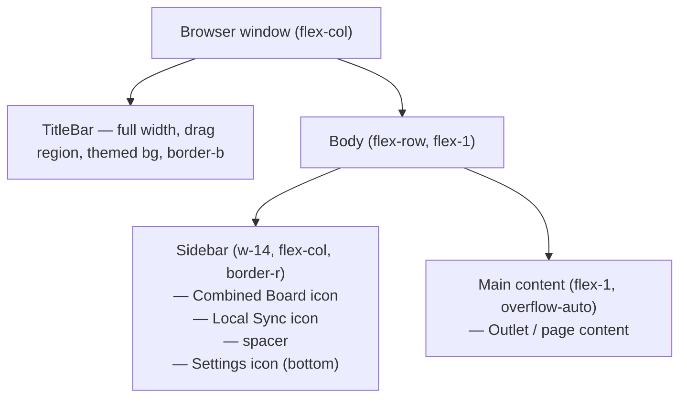
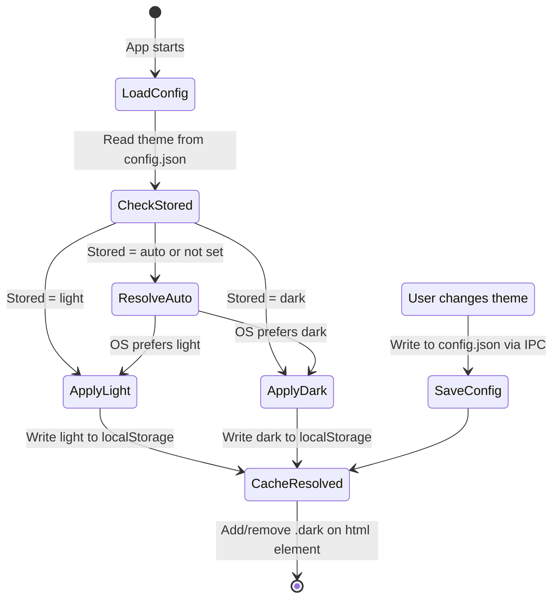
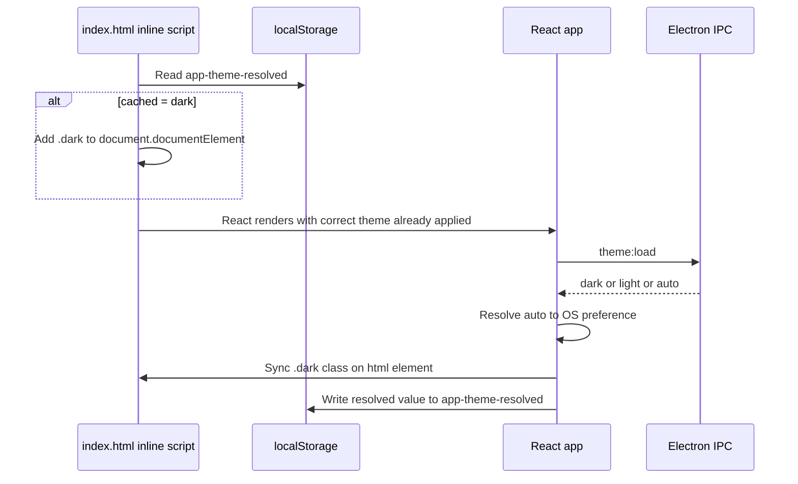

# Refresh application appearance and style

## Summary

Refresh the application's visual appearance by replacing the title-bar navigation with an icon-only sidebar, introducing a subtle blue-tinted light/dark theme system, and adding an Appearance settings page for theme selection. The title bar is retained as a pure drag region styled to match the content background. The new theme system supports Light, Dark, and Auto (OS-matched) modes, persisted in `config.json`, with flash-of-incorrect-theme (FOCT) prevention on startup.

## Detailed description

### Layout restructure

The current layout (`flex-col`: title bar → `<Outlet />`) becomes a three-zone layout:

1. **Title bar** — spans full window width, no navigation content, themed background, subtle bottom border, window drag region.
2. **Sidebar** — fixed-width vertical strip to the left, icon-only navigation, subtle right border.
3. **Main content** — fills remaining space to the right of the sidebar, scrollable.

The title bar and sidebar both adopt the themed background colour, maintaining visual cohesion.

### Title bar

- Retains its full-width span across the window.
- Background matches the themed content background (no longer `bg-neutral-900`).
- A subtle bottom border separates it from the sidebar/content area.
- Remains the window drag region (`-webkit-app-region: drag`).
- Contains only: macOS traffic-light spacer (left, when platform is `darwin`) and Windows/Linux window controls (right). No text or navigation.
- Window controls remain `[-webkit-app-region:no-drag]` and adapt colour to the active theme.

### Sidebar

- Fixed width (e.g. `w-14`, ~56 px).
- Icon-only navigation — no labels.
- Three items: Combined Board (kanban icon), Local Sync (refresh/sync icon), Settings (gear icon).
- Settings is pinned to the **bottom** of the sidebar; Combined Board and Local Sync sit at the top.
- Each icon button shows a **right-side tooltip** on hover displaying the page name.
- Active route: icon styled with the theme's accent/active colour (e.g. slightly brighter or background highlight).
- Inactive: icon at the theme's muted colour (`#333`/`#ccc`), brightens on hover.
- Subtle right border separating the sidebar from the main content.
- The sidebar is not draggable.

### Theme system

Three modes:

| Mode | Behaviour |
|------|-----------|
| **Light** | Slightly off-white background with a blue tint (approx. `hsl(214, 45%, 96%)`). Text and icons `#333333`. |
| **Dark** | Slightly off-black background with a blue tint (approx. `hsl(214, 25%, 11%)`). Text and icons `#cccccc`. |
| **Auto** | Reads the OS `prefers-color-scheme` setting at runtime and applies Light or Dark accordingly. Updates immediately if the OS setting changes while the app is running. |

Default is **Auto**.

Implementation uses Tailwind v4's class-based dark mode variant, toggling a `dark` class on `<html>`. When `Auto` is selected, the resolved value is derived from `window.matchMedia("(prefers-color-scheme: dark)")`.

The window controls (minimise/maximise/close) in `WindowControls.tsx` use `currentColor` and should inherit the themed text colour naturally.

#### FOCT prevention

To prevent a flash of incorrect theme during startup, a small inline script is embedded in `index.html` before any other scripts. It reads a cached resolved theme value from `localStorage` (`app-theme-resolved`) and immediately adds the `dark` class to `<html>` if needed. On every theme load or change, the renderer writes the resolved value back to `localStorage` to keep it current. On first launch (no cached value), `Auto` is the default, so no `dark` class is applied; the OS media query handles this correctly if Tailwind is also configured to respect `prefers-color-scheme` as a fallback.

### Appearance settings page

- Added as the **first section** in the Settings sidebar, labelled "Appearance".
- `/settings` route defaults to the Appearance section (not Connection).
- Contains three **theme preview cards** displayed in a row, one per theme option.
- Each card is a mini UI mock showing: a thin coloured strip (title bar), a narrow coloured strip (sidebar), and a larger coloured block (content area), all in that theme's actual colours. A label beneath the card names the theme.
- The currently selected card has a visible border/ring; others are unstyled or subtly bordered.
- Clicking a card immediately applies the theme to the running app and persists it to `config.json`.

### Data persistence

- Theme preference stored in `config.json` as a new top-level `theme` field: `"light" | "dark" | "auto"`.
- Two new IPC channels: `theme:load` (returns `ThemePreference`) and `theme:save` (accepts `ThemePreference`).
- Loaded on startup in `App.tsx` alongside the existing settings load.
- The resolved theme (auto → light/dark) is additionally mirrored to `localStorage("app-theme-resolved")` for FOCT prevention.

### Borders and subtle styling

- Title bar: 1 px bottom border, `rgba(0,0,0,0.08)` in light mode, `rgba(255,255,255,0.08)` in dark mode.
- Sidebar: 1 px right border, same treatment.
- Both borders should feel like a soft division rather than a strong separator.

## User stories

- As a user, I want the navigation to be out of the way as a compact icon sidebar, so that I can focus on the board content without a navigation bar taking up vertical space.
- As a user, I want to hover over a sidebar icon and see the page name, so that I can quickly identify where each icon leads when I am unfamiliar with the icons.
- As a user, I want to choose a light, dark, or automatic theme, so that the app matches my environment and personal preference.
- As a user, I want the app to open with the correct theme every time, so that I never see an unwanted flash of a bright or dark screen on startup.
- As a user, I want the Settings gear icon to always be at the bottom of the sidebar, so that it is consistently separated from the main navigation items.

## Key decisions

| Decision | Outcome |
|----------|---------|
| Navigation moved to icon-only sidebar | Remove text nav from title bar; use icon buttons with hover tooltips instead. Settings pinned to bottom. |
| Title bar is drag region only | No text, logo, or navigation in the title bar after this change. Background matches content. |
| Theme stored in config.json | Consistent with how PAT, board selections, and other settings are persisted. Requires two new IPC channels. |
| FOCT must be prevented | Inline script in `index.html` reads `localStorage` to apply `dark` class before React renders. |
| Icon library: lucide-react | Add `lucide-react` as a runtime dependency for the kanban, refresh, and settings icons. Consistent set, well-maintained, tree-shakeable. |
| Theme preview cards are mini UI mocks | Cards show a scaled-down representation of the title bar, sidebar, and content area in the theme's actual colours. |
| Appearance section is first in Settings | `/settings` defaults to the Appearance section, not Connection. |
| No sidebar logo or app name | The sidebar contains icons only; no branding at the top. |

## Diagrams

### Application layout (after change)



### Theme resolution flow



### FOCT prevention sequence



## Acceptance criteria

```gherkin
Feature: Icon sidebar navigation

  Scenario: Sidebar replaces title-bar navigation
    Given the application is open
    Then I see a vertical sidebar with icon buttons
    And I do not see text navigation links in the title bar

  Scenario: Combined Board icon navigates correctly
    Given the application is open
    When I click the kanban icon in the sidebar
    Then I am on the Combined Board page
    And the kanban icon appears in its active state

  Scenario: Local Sync icon navigates correctly
    Given the application is open
    When I click the refresh/sync icon in the sidebar
    Then I am on the Local Sync page
    And the refresh icon appears in its active state

  Scenario: Settings icon is pinned to the bottom
    Given the application is open
    Then the gear/settings icon is visually separated from the other nav icons
    And it appears at the bottom of the sidebar

  Scenario: Settings icon navigates correctly
    Given the application is open
    When I click the gear icon in the sidebar
    Then I am on the Settings page

  Scenario: Hover tooltip on Combined Board sidebar icon
    Given the application is open
    When I hover over the Combined Board sidebar icon
    Then a tooltip appears to the right reading "Combined Board"

  Scenario: Hover tooltip on Local Sync icon
    Given the application is open
    When I hover over the Local Sync sidebar icon
    Then a tooltip appears to the right reading "Local Sync"

  Scenario: Hover tooltip on Settings icon
    Given the application is open
    When I hover over the Settings sidebar icon
    Then a tooltip appears to the right reading "Settings"

Feature: Title bar appearance

  Scenario: Title bar background matches app content
    Given the application is open
    Then the title bar background colour matches the main content background colour

  Scenario: Title bar has a subtle bottom border
    Given the application is open
    Then the title bar has a visible but subtle bottom border

  Scenario: Title bar is the drag region
    Given the application is open
    When I click and drag the title bar area
    Then the window moves

  Scenario: Window controls are still visible on Windows
    Given I am running the application on Windows
    Then the minimise, maximise, and close buttons are visible in the title bar

Feature: Theme system

  Scenario: Default theme is Auto
    Given I have never changed the theme setting
    Then the theme resolves according to the OS colour scheme preference

  Scenario: Light theme applies correct colours
    Given I open the Settings page
    And I select the Light theme
    Then the app background becomes slightly off-white with a blue tint
    And all text and icons use the colour #333333

  Scenario: Dark theme applies correct colours
    Given I open the Settings page
    And I select the Dark theme
    Then the app background becomes slightly off-black with a blue tint
    And all text and icons use the colour #cccccc

  Scenario: Auto theme uses OS light preference
    Given my OS is set to light mode
    And the theme is set to Auto
    Then the app renders in the light theme

  Scenario: Auto theme uses OS dark preference
    Given my OS is set to dark mode
    And the theme is set to Auto
    Then the app renders in the dark theme

  Scenario: Theme change is immediate
    Given the application is open on the Settings Appearance page
    When I click a different theme card
    Then the app theme changes immediately without requiring a restart

  Scenario: Theme persists across restarts
    Given I set the theme to Dark
    When I close and reopen the application
    Then the application opens in the dark theme

  Scenario: No flash of incorrect theme on startup
    Given my saved theme is Dark
    When I launch the application
    Then the app renders in dark mode from the first visible frame

Feature: Appearance settings page

  Scenario: Appearance is the first Settings section
    Given I navigate to Settings
    Then the Appearance section is the first item in the Settings sidebar
    And the Appearance section is shown by default

  Scenario: Three theme cards are displayed
    Given I am on the Settings Appearance page
    Then I see three theme cards labelled Light, Dark, and Auto

  Scenario: Active theme card has a border
    Given I am on the Settings Appearance page
    And the current theme is Dark
    Then the Dark card has a visible border or ring
    And the Light and Auto cards do not have that border

  Scenario: Theme cards show mini UI mocks
    Given I am on the Settings Appearance page
    Then each theme card shows a miniature representation of the app layout
    And each mock includes a title bar strip, sidebar strip, and content area in the theme colours

  Scenario: Clicking a theme card saves and applies the theme
    Given I am on the Settings Appearance page
    When I click the Light theme card
    Then the light theme is applied immediately
    And the Light card shows as selected
    And the next time I open Settings Appearance, Light is still selected
```

## Manual test steps

### 1. Sidebar navigation

1. Launch the application.
2. Confirm there are **no text links** in the title bar.
3. Locate the vertical icon sidebar on the left side of the window.
4. Confirm the sidebar contains exactly three icons: a kanban-style icon, a refresh/sync icon, and a gear icon.
5. Confirm the gear (Settings) icon is separated from the other two and sits at the bottom of the sidebar.
6. Click the kanban icon. Confirm you are taken to the Combined Board page and the kanban icon appears highlighted/active.
7. Click the sync icon. Confirm you are taken to the Local Sync page and the sync icon appears highlighted/active.
8. Click the gear icon. Confirm you are taken to the Settings page and the gear icon appears highlighted/active.
9. Hover over the kanban icon. Confirm a tooltip appears to the right saying "Combined Board".
10. Hover over the sync icon. Confirm a tooltip appears to the right saying "Local Sync".
11. Hover over the gear icon. Confirm a tooltip appears to the right saying "Settings".

### 2. Title bar

1. Confirm the title bar spans the full width of the window.
2. Confirm the title bar background colour matches the main content/sidebar background (not black).
3. Confirm the title bar has a subtle bottom border separating it from the content below.
4. Click and drag the title bar. Confirm the window moves.
5. (Windows only) Confirm minimise, maximise, and close buttons are visible and functional in the title bar top-right corner.

### 3. Theme selection

1. Navigate to **Settings** by clicking the gear icon in the sidebar.
2. Confirm the **Appearance** section opens automatically (it is the first section).
3. Confirm you see three clearly labelled theme cards: **Light**, **Dark**, and **Auto**.
4. Confirm each card shows a mini UI mock with a title bar strip, sidebar strip, and content area.
5. Confirm the currently active theme card has a visible border or ring around it.
6. Click the **Dark** card.
   - Confirm the app background turns dark (nearly black with a blue tint).
   - Confirm text and icons change to a light grey (#cccccc).
   - Confirm the Dark card now shows the selected border.
7. Click the **Light** card.
   - Confirm the app background turns light (off-white with a blue tint).
   - Confirm text and icons change to a dark grey (#333333).
8. Click the **Auto** card.
   - Confirm the app adopts the same theme as your current OS setting.
9. Close the application and reopen it.
   - Confirm the theme that was active before closing is restored on relaunch.
   - Confirm there is no flash of a differently-themed screen during startup.

### 4. Auto theme following OS

1. Set the app theme to **Auto**.
2. Change your OS to light mode. Confirm the app switches to the light theme immediately (no restart needed).
3. Change your OS to dark mode. Confirm the app switches to the dark theme immediately.

### 5. Sidebar and title bar visual style

1. In both Light and Dark themes, confirm the title bar has a subtle bottom border.
2. In both Light and Dark themes, confirm the sidebar has a subtle right-side border.
3. In both themes, confirm inactive sidebar icons are visible but muted, and become slightly brighter on hover.
4. Confirm the window controls (on Windows) visually suit the active theme and are not stuck on the original dark-mode appearance.

## Implementation tasks

Tasks are ordered by dependency. Each task lists the exact files to create or modify.

### 1. Install lucide-react

- Run `npm install lucide-react`.
- No code changes required at this step.
- **Dependency:** none.

### 2. Add theme type and persistence to the config layer

- **File:** `src/config.ts`
- Add `export type ThemePreference = "light" | "dark" | "auto"`.
- Add `theme?: ThemePreference` to the `ConfigFile` interface.
- Add `loadTheme(): ThemePreference` returning `readConfigFile().theme ?? "auto"`.
- Add `saveTheme(theme: ThemePreference): void` calling `writeConfigFile({ ...readConfigFile(), theme })`.
- **Dependency:** none.

### 3. Add IPC handlers for theme in main process

- **File:** `src/main.ts`
- Import `loadTheme`, `saveTheme`, `ThemePreference` from `./config`.
- Register `ipcMain.handle("theme:load", () => loadTheme())`.
- Register `ipcMain.handle("theme:save", (_e, theme: ThemePreference) => saveTheme(theme))`.
- **Dependency:** task 2.

### 4. Expose theme API in shared types and preload

- **File:** `src/shared/electronAPI.ts`
- Add `export type ThemePreference = "light" | "dark" | "auto"`.
- Add to `ElectronAPI`: `loadTheme: () => Promise<ThemePreference>` and `saveTheme: (theme: ThemePreference) => Promise<void>`.
- **File:** `src/preload.ts`
- Add `loadTheme: () => ipcRenderer.invoke("theme:load")` and `saveTheme: (theme) => ipcRenderer.invoke("theme:save", theme)` to the `api` object.
- **Dependency:** task 3.

### 5. Configure Tailwind v4 for class-based dark mode and define theme tokens

- **File:** `src/index.css`
- After `@import "tailwindcss";`, add the custom dark variant and CSS custom properties:

```css
@custom-variant dark (&:where(.dark, .dark *));

:root {
  --color-bg: hsl(214, 45%, 96%);
  --color-text: #333333;
  --color-border: rgba(0, 0, 0, 0.08);
  --color-sidebar-hover: rgba(0, 0, 0, 0.06);
  --color-active: rgba(0, 0, 0, 0.10);
}

.dark {
  --color-bg: hsl(214, 25%, 11%);
  --color-text: #cccccc;
  --color-border: rgba(255, 255, 255, 0.08);
  --color-sidebar-hover: rgba(255, 255, 255, 0.06);
  --color-active: rgba(255, 255, 255, 0.10);
}
```

- **Dependency:** none.

### 6. Add FOCT prevention inline script to index.html

- **File:** `index.html`
- Add the following as the first script tag inside `<head>`, before any other scripts:

```html
<script>
  (function () {
    var resolved = localStorage.getItem("app-theme-resolved");
    if (resolved === "dark") {
      document.documentElement.classList.add("dark");
    }
  })();
</script>
```

- **Dependency:** task 5.

### 7. Create a shared theme utility

- **File:** `src/renderer/theme.ts` (new file)
- Export `applyTheme(theme: ThemePreference): void`:
  - Resolves `"auto"` using `window.matchMedia("(prefers-color-scheme: dark)").matches`.
  - Calls `document.documentElement.classList.toggle("dark", resolved === "dark")`.
  - Calls `localStorage.setItem("app-theme-resolved", resolved)`.
- **Dependency:** task 4.

### 8. Add theme state to the app store

- **File:** `src/renderer/store/appStore.ts`
- Import `ThemePreference` from `../../shared/electronAPI`.
- Add `theme: ThemePreference` to `AppState`, defaulting to `"auto"`.
- Add `setTheme: (theme: ThemePreference) => void` to `AppState`.
- Implement `setTheme: (theme) => set({ theme })`.
- **Dependency:** task 4.

### 9. Load theme on startup and restructure layout in App.tsx

- **File:** `src/renderer/App.tsx`
- Import `applyTheme` from `./theme`.
- In the startup `useEffect`, add `window.electron.loadTheme().then((theme) => { setTheme(theme); applyTheme(theme); })`.
- Add a `useEffect` that watches the `theme` value from the store. When `theme === "auto"`, register a `matchMedia` change listener that calls `applyTheme("auto")`. Clean up the listener on unmount or when theme changes away from auto.
- Change root `div` className: replace `bg-white text-neutral-900` with `bg-[var(--color-bg)] text-[var(--color-text)]`.
- Change layout structure:
  ```tsx
  <div className="flex flex-col h-screen w-screen overflow-hidden bg-[var(--color-bg)] text-[var(--color-text)]">
    <TitleBar />
    <div className="flex flex-1 overflow-hidden">
      <Sidebar />
      <main className="flex-1 overflow-auto">
        <Outlet />
      </main>
    </div>
  </div>
  ```
- **Dependency:** tasks 5, 7, 8.

### 10. Refactor TitleBar to a pure drag region

- **File:** `src/renderer/components/TitleBar/TitleBar.tsx`
- Remove the `navItems` array and all `NavLink` elements and the navigation div.
- Replace `bg-neutral-900` with `bg-[var(--color-bg)] border-b border-[var(--color-border)]`.
- Keep the macOS spacer, flex-1 spacer, and `WindowControls`.
- **File:** `src/renderer/components/TitleBar/WindowControls.tsx`
- Replace `text-gray-400 hover:text-white` with `text-[var(--color-text)]/60 hover:text-[var(--color-text)]` so controls adapt to the active theme.
- **Dependency:** task 5.

### 11. Create the Sidebar component

- **File:** `src/renderer/components/Sidebar/Sidebar.tsx` (new file)
- Import `NavLink` from `react-router-dom`.
- Import `LayoutDashboard`, `RefreshCw`, `Settings` from `lucide-react`.
- Define two nav item groups: top items (Combined Board, Local Sync) and bottom items (Settings).
- Render a `nav` with classes `flex flex-col h-full w-14 shrink-0 border-r border-[var(--color-border)] [-webkit-app-region:no-drag]`.
- Top section: `div` with `flex flex-col gap-1 p-2` containing the top nav items.
- Spacer: `div` with `flex-1`.
- Bottom section: `div` with `flex flex-col gap-1 p-2` containing the bottom nav items.
- Each item: a `relative group` div wrapping a `NavLink` with the icon. Active class uses `bg-[var(--color-active)] text-[var(--color-text)]`; inactive uses `text-[var(--color-text)]/50 hover:bg-[var(--color-sidebar-hover)] hover:text-[var(--color-text)]`.
- Tooltip: an absolutely-positioned `span` appearing to the right on `group-hover`, using `opacity-0 group-hover:opacity-100 transition-opacity`, positioned with `left-full ml-2`, styled as a small pill with `bg-[var(--color-bg)] border border-[var(--color-border)] text-[var(--color-text)] shadow-sm`.
- **Dependency:** tasks 5, 9.

### 12. Create the AppearanceSection component

- **File:** `src/renderer/components/Settings/AppearanceSection.tsx` (new file)
- Import `ThemePreference` from `../../../shared/electronAPI`.
- Import `useAppStore` from `../../store/appStore`.
- Import `applyTheme` from `../../theme`.
- Define a `ThemeCard` function component (within the same file) with props `{ value: ThemePreference, label: string, selected: boolean, onSelect: () => void }`.
  - Mini mock: a `div` approximately `w-32 h-20` with a small title bar strip at the top, and a row below containing a narrow sidebar strip and a wider content area, all using hardcoded colour values matching each theme.
  - Selected state: `ring-2 ring-blue-500`; unselected: `ring-1 ring-[var(--color-border)]`.
  - Label `span` below the card.
- `AppearanceSection` renders a `flex flex-row gap-4` row of all three theme cards.
- On card click: call `window.electron.saveTheme(value)`, `setTheme(value)`, `applyTheme(value)`.
- **Dependency:** tasks 7, 8.

### 13. Update SettingsPage to include Appearance as the first section

- **File:** `src/renderer/pages/SettingsPage.tsx`
- Add `"appearance"` as the first member of the `SettingsSection` type union.
- Add `{ id: "appearance", label: "Appearance" }` as the first entry in the `sections` array.
- Change `useState` initial value from `"connection"` to `"appearance"`.
- Add a conditional render for the appearance section that renders `AppearanceSection` inside a padded div.
- Import `AppearanceSection` from `../components/Settings/AppearanceSection`.
- **Dependency:** task 12.

### 14. Write tests for AppearanceSection and the theme utility

- **File:** `src/renderer/components/Settings/AppearanceSection.test.ts` (new file)
- Mock `window.electron.saveTheme` and `window.matchMedia`.
- Test: clicking the Dark card calls `window.electron.saveTheme("dark")`.
- Test: clicking the Light card calls `window.electron.saveTheme("light")`.
- Test: clicking the Auto card calls `window.electron.saveTheme("auto")`.
- Test: the selected card has the correct ring class applied.
- Test: `applyTheme("dark")` adds `.dark` to `document.documentElement`.
- Test: `applyTheme("light")` removes `.dark` from `document.documentElement`.
- Test: `applyTheme("auto")` with `matchMedia` returning dark adds `.dark`.
- Test: `applyTheme("auto")` with `matchMedia` returning light removes `.dark`.
- Follow the existing pattern in `src/renderer/components/Settings/CombinedBoardSection.test.ts`.
- **Dependency:** tasks 12, 7.
