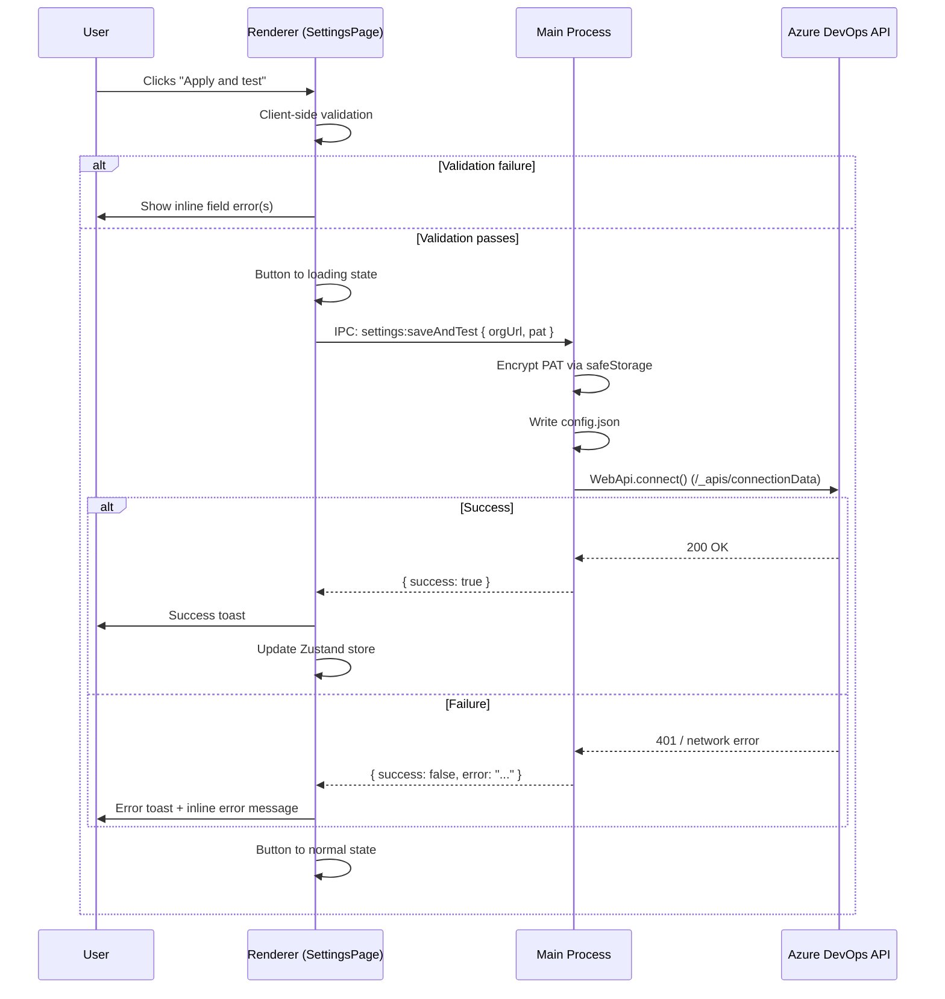
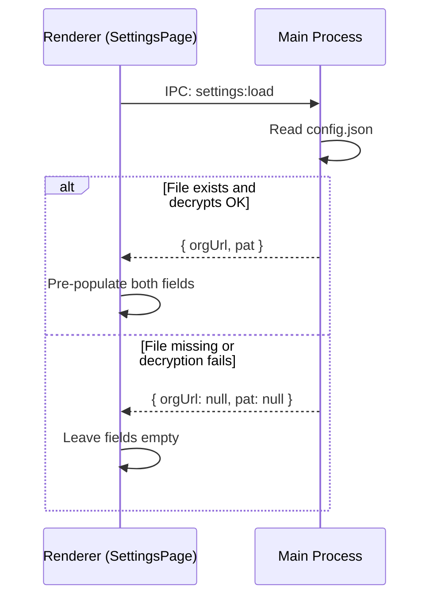

# Settings - Personal Access Token

## Summary

Implement the Settings page with an "Azure DevOps" section that lets users configure their organisation URL and Personal Access Token (PAT). Both values are encrypted at rest using Electron's `safeStorage` API and persisted across app restarts. An "Apply and test" button saves the credentials and validates them against the AzDO API, reporting success or failure via toast notification and inline error messaging.

This is the first feature to use the Settings page and establishes the Settings page layout (two-panel: sidebar + content area) that future settings sections will reuse.

## Detailed description

### Page layout

The Settings page uses a two-panel layout scoped to the Settings route:

- **Left sidebar** — a narrow column listing settings sections as nav links. Currently one item: "Azure DevOps". Active section is visually highlighted.
- **Right content area** — renders the active section's form.

This layout lives entirely within `SettingsPage.tsx`; no global app-level shell is part of this feature.

### Azure DevOps section

The form contains two inputs and one action button:

**Organisation URL**
- Text input, placeholder: `https://dev.azure.com/your-organisation`
- Pre-populated from saved config on page load if available
- Required; must be a non-empty string (deeper URL validation is out of scope for this feature)

**Personal Access Token**
- Password-type input (masked by default), placeholder: `Paste your PAT here`
- Pre-populated with the decrypted stored value on page load if available
- Show/hide toggle button beside the input (eye icon) to toggle `type="password"` / `type="text"`
- Required; must be a non-empty string

**Apply and test button**
1. Client-side validates that both fields are non-empty. If either is empty, display an inline validation error beneath the offending field and abort.
2. Button enters a loading/disabled state (spinner replaces label) while the operation is in progress.
3. An IPC call is made to the main process with `{ orgUrl, pat }`.
4. The main process:
   a. Encrypts the PAT using `safeStorage.encryptString()`.
   b. Writes `orgUrl` (plaintext) and the base64-encoded encrypted PAT to `config.json` in `app.getPath('userData')`.
   c. Attempts to connect to the AzDO API using `azure-devops-node-api`: creates a `WebApi` connection with the personal access token handler and calls `connection.connect()`.
   d. Returns `{ success: boolean, error?: string }`.
5. If **success**: show a success toast ("Connected to Azure DevOps successfully."). Update the Zustand store with `orgUrl` and `pat`.
6. If **failure**: show an error toast ("Connection failed.") and display the error message below the PAT input field. Credentials are still saved (so the user does not lose their PAT on a transient network failure). Clear any previous inline error before showing the new one.
7. Button returns to its normal state.

### Persistence and loading

On `SettingsPage` mount, an IPC call retrieves `{ orgUrl, pat }` from the main process (reads and decrypts config.json). Both fields are pre-populated. If the file does not exist or a field is missing, the corresponding input is left empty. If decryption fails (e.g. the config was moved across machines), the field is left empty and a console warning is logged.

### Config file schema

Stored at `<userData>/config.json`:

```json
{
  "orgUrl": "https://dev.azure.com/myorg",
  "encryptedPat": "<base64-encoded safeStorage bytes>"
}
```

### Error states

| Scenario | Behaviour |
|---|---|
| Either field is empty on submit | Inline validation error below the empty field; no IPC call |
| AzDO returns 401 Unauthorised | Error toast + "Invalid PAT or insufficient permissions." below PAT input |
| AzDO org URL unreachable / DNS failure | Error toast + "Could not reach the organisation URL. Check the URL and your network." below URL input |
| `safeStorage` unavailable (e.g. headless CI) | Log a warning; fall back to storing PAT base64-encoded without OS encryption |
| Config file missing on load | Treat as no credentials saved; both fields empty |
| Config decryption failure on load | Leave fields empty; log warning |

## User stories

- *As a user, I want to enter and save my Azure DevOps organisation URL and PAT, so that the app can authenticate with AzDO on my behalf.*
- *As a user, I want the app to test my credentials immediately when I save them, so that I know they are correct before using other features.*
- *As a user, I want my PAT to be stored securely on my machine, so that it is not readable in plain text by other processes.*
- *As a user, I want my credentials to persist across app restarts, so that I do not have to re-enter them each session.*

## Key decisions

| Decision | Outcome |
|---|---|
| Organisation URL in scope | Include an org URL input alongside the PAT in this feature, since the PAT test requires it and it is a fundamental credential |
| Settings layout scope | Settings-internal sidebar only; no global app-level nav shell in this feature |
| PAT masking | Masked by default with a show/hide toggle for usability and basic accidental-exposure protection |
| PAT storage mechanism | Electron `safeStorage` API — OS-level encryption with no additional dependencies |
| Save even on failed test | Credentials are always saved on "Apply and test" (network failures are transient; losing a typed PAT is frustrating) |
| Toast library | Sonner — lightweight, modern, no heavy dependency |
| AzDO API client | `azure-devops-node-api` — the official library, consistent with future features that will use it for board/sync operations |
| PAT returned to renderer | The decrypted PAT is sent back to the renderer on load to pre-populate the field. Acceptable risk for a single-user desktop app |

## Validation

| Field | Rule | Error message |
|---|---|---|
| Organisation URL | Required (non-empty) | "Organisation URL is required." |
| PAT | Required (non-empty) | "Personal Access Token is required." |

## Diagrams

### "Apply and test" sequence



### Settings page load sequence



## Acceptance criteria

```gherkin
Feature: Settings - Azure DevOps PAT

  Background:
    Given the app is running

  Scenario: Settings page has a sidebar with an Azure DevOps section
    When I navigate to the Settings page
    Then I see a sidebar on the left
    And the sidebar contains a link labelled "Azure DevOps"
    And the "Azure DevOps" link is active/highlighted by default
    And the content area shows the Azure DevOps settings form

  Scenario: Azure DevOps form contains the expected inputs
    When I navigate to the Settings page
    Then I see a text input labelled "Organisation URL"
    And I see a masked password input labelled "Personal Access Token"
    And I see a show/hide toggle button beside the PAT input
    And I see an "Apply and test" button

  Scenario: No credentials saved - empty state
    Given no credentials have been saved
    When I navigate to the Settings page
    Then the Organisation URL field is empty
    And the PAT field is empty

  Scenario: Credentials saved - fields are pre-populated on load
    Given an organisation URL and PAT have been previously saved
    When I navigate to the Settings page
    Then the Organisation URL field is pre-populated with the saved URL
    And the PAT field is pre-populated (value is masked)

  Scenario: PAT show/hide toggle reveals and hides the value
    Given the PAT field contains a value
    When I click the show/hide toggle
    Then the PAT value is visible as plain text
    When I click the show/hide toggle again
    Then the PAT value is masked

  Scenario: Apply and test - both fields empty - shows validation errors
    Given both fields are empty
    When I click "Apply and test"
    Then I see a validation error "Organisation URL is required." below the URL field
    And I see a validation error "Personal Access Token is required." below the PAT field
    And no connection attempt is made

  Scenario: Apply and test - org URL empty - shows validation error
    Given the PAT field contains a value
    And the Organisation URL field is empty
    When I click "Apply and test"
    Then I see a validation error "Organisation URL is required." below the URL field
    And no connection attempt is made

  Scenario: Apply and test - PAT empty - shows validation error
    Given the Organisation URL field contains a value
    And the PAT field is empty
    When I click "Apply and test"
    Then I see a validation error "Personal Access Token is required." below the PAT field
    And no connection attempt is made

  Scenario: Apply and test - button shows loading state
    Given valid-looking values are in both fields
    When I click "Apply and test"
    Then the button becomes disabled
    And a loading indicator is shown in the button
    And the button returns to its normal state after the operation completes

  Scenario: Apply and test - success
    Given a valid organisation URL and valid PAT are entered
    When I click "Apply and test"
    Then the credentials are saved to disk (encrypted)
    And a success toast "Connected to Azure DevOps successfully." is shown
    And no inline error is shown

  Scenario: Apply and test - invalid PAT (401)
    Given a valid organisation URL and an invalid PAT are entered
    When I click "Apply and test"
    Then the credentials are still saved to disk
    And an error toast "Connection failed." is shown
    And an inline error "Invalid PAT or insufficient permissions." is shown below the PAT field

  Scenario: Apply and test - unreachable org URL
    Given an unreachable organisation URL and a PAT are entered
    When I click "Apply and test"
    Then the credentials are still saved to disk
    And an error toast "Connection failed." is shown
    And an inline error message is shown below the Organisation URL field

  Scenario: Credentials persist across app restarts
    Given I have successfully saved credentials using "Apply and test"
    When I close and reopen the app
    And I navigate to the Settings page
    Then the Organisation URL field is pre-populated with the saved URL
    And the PAT field is pre-populated
```

## Manual test steps

1. **Navigate to Settings**
   - Launch the app.
   - Click the Settings nav link (if visible) or navigate to the Settings route directly.
   - Confirm you see a left sidebar with "Azure DevOps" and a content panel to the right.

2. **Empty state**
   - If this is a fresh install (or after clearing app data), confirm the Organisation URL and PAT fields are both empty.

3. **Enter credentials**
   - Type a valid AzDO org URL (e.g. `https://dev.azure.com/your-org`) into the Organisation URL field.
   - Paste a valid PAT into the PAT field. Confirm the value appears as dots.

4. **Show/hide toggle**
   - Click the show/hide toggle beside the PAT field.
   - Confirm the PAT value is now visible as plain text.
   - Click again and confirm it is masked.

5. **Validation - empty fields**
   - Clear both fields and click "Apply and test".
   - Confirm two validation errors appear (one per field) and no network request is made.

6. **Apply and test - success**
   - Enter a valid org URL and a valid PAT.
   - Click "Apply and test".
   - Confirm the button briefly shows a loading/spinner state.
   - Confirm a green success toast appears.
   - Confirm no inline error message is shown.

7. **Apply and test - invalid PAT**
   - Enter a valid org URL and a deliberately wrong PAT (e.g. `invalid-token`).
   - Click "Apply and test".
   - Confirm a red error toast appears.
   - Confirm an inline error is shown below the PAT field.

8. **Persistence across restarts**
   - After a successful save (step 6), close the app fully.
   - Relaunch the app and navigate to Settings.
   - Confirm the Organisation URL is pre-populated.
   - Confirm the PAT field is pre-populated (masked).

9. **Update credentials**
   - With credentials already saved, change the org URL to a different value.
   - Click "Apply and test" with a valid PAT.
   - Close and reopen the app.
   - Confirm the updated org URL is shown.

## Implementation tasks

> Dependencies are noted inline. Complete tasks in order.

1. **Install dependencies**
   - `npm install sonner azure-devops-node-api`
   - No task dependencies.

2. **Create `src/config.ts` (main-process config helpers)**
   - `loadConfig()` reads `<userData>/config.json`, decrypts PAT via `safeStorage.decryptString()`, returns `{ orgUrl: string | null, pat: string | null }`.
   - `saveConfig({ orgUrl, pat })` encrypts PAT via `safeStorage.encryptString()`, writes file with `encryptedPat` as base64.
   - If `safeStorage.isEncryptionAvailable()` is false, log a warning and store PAT as plain base64.
   - Depends on: task 1.

3. **Create AzDO connection test helper (can live in `src/azdo.ts`)**
   - `testConnection({ orgUrl, pat })` uses `azure-devops-node-api` `WebApi.connect()`, returns `{ success: boolean, error?: string }`.
   - Normalise errors: 401 → `"Invalid PAT or insufficient permissions."`, network error → `"Could not reach the organisation URL. Check the URL and your network."`, other → the raw error message.
   - Depends on: task 1.

4. **Register IPC handlers in `src/main.ts`**
   - `ipcMain.handle('settings:load', ...)` calls `loadConfig()`.
   - `ipcMain.handle('settings:saveAndTest', (_, { orgUrl, pat }) => ...)` calls `saveConfig()` then `testConnection()`, returns `{ success, error? }`.
   - Follow the existing `ipcMain.on('window:minimise', ...)` pattern.
   - Depends on: tasks 2 and 3.

5. **Update `src/shared/electronAPI.ts`**
   - Add to `ElectronAPI` interface:
     ```ts
     loadSettings: () => Promise<{ orgUrl: string | null; pat: string | null }>;
     saveAndTestSettings: (args: { orgUrl: string; pat: string }) => Promise<{ success: boolean; error?: string }>;
     ```
   - No task dependencies (interface-only change).

6. **Update `src/preload.ts`**
   - Expose the two new IPC methods via `contextBridge` using `ipcRenderer.invoke`, following the existing `minimise/maximise/close` pattern.
   - Depends on: tasks 4 and 5.

7. **Add `<Toaster />` to app root (`src/renderer.tsx`)**
   - Import `Toaster` from `sonner` and render it alongside `<RouterProvider>`.
   - Depends on: task 1.

8. **Implement `SettingsPage.tsx`**
   - Two-panel layout: left sidebar + right content area.
   - Sidebar: single "Azure DevOps" link with active state styling.
   - Azure DevOps panel: org URL text input, PAT password input with show/hide toggle, "Apply and test" button with loading state.
   - On mount: call `window.electron.loadSettings()` and pre-populate fields.
   - On submit: validate → `window.electron.saveAndTestSettings()` → `toast.success()` or `toast.error()` from `sonner` → show/clear inline error.
   - Depends on: tasks 6 and 7.

9. **Update Zustand store (`src/renderer/store/appStore.ts`)**
   - Add `orgUrl: string | null`, `pat: string | null` state fields and a `setAzDoCredentials(orgUrl, pat)` action.
   - `SettingsPage` dispatches `setAzDoCredentials` on a successful "Apply and test".
   - Makes credentials available to future board/sync features without additional IPC calls.
   - Depends on: task 8.

10. **Write tests for config and connection logic**
    - Co-located test file `src/config.test.ts`: test `loadConfig()` with missing file, corrupt JSON, and valid encrypted data; test `saveConfig()` round-trip; test `testConnection()` error normalisation using mocked `azure-devops-node-api`.
    - Depends on: tasks 2 and 3.