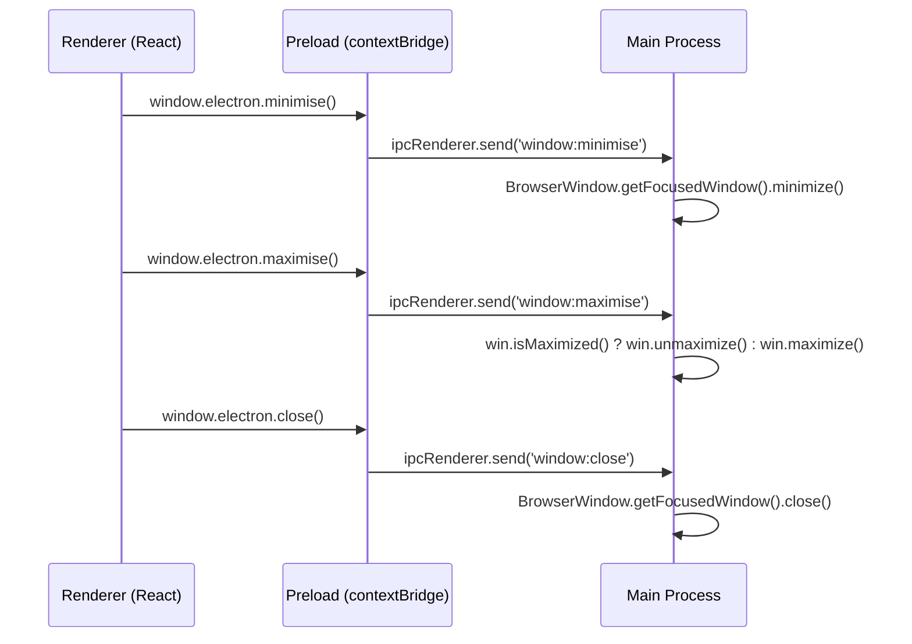
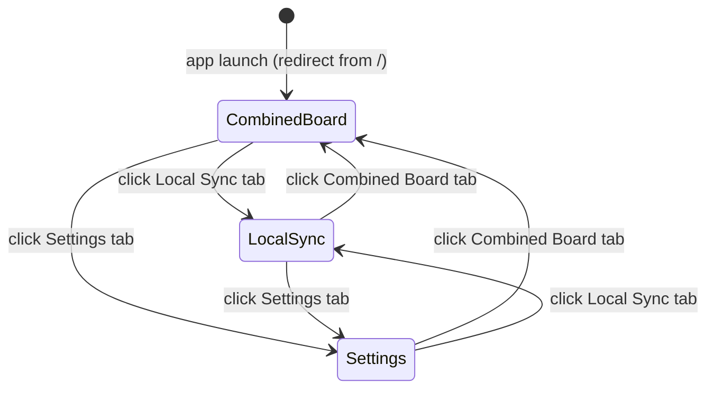
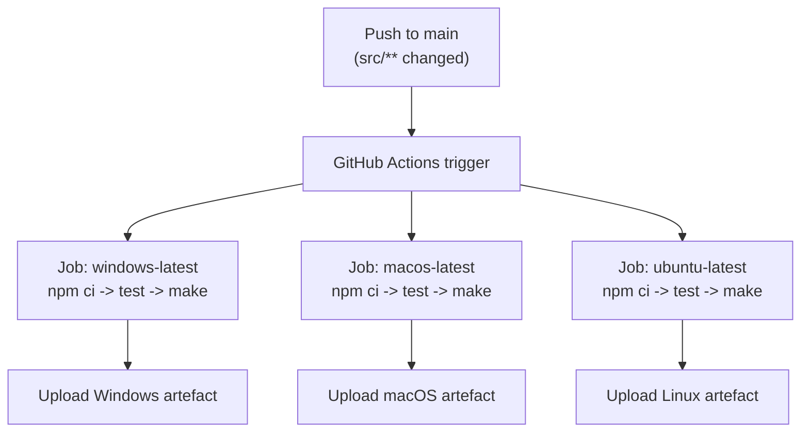

# Spike out Electron app

## Summary

Bootstrap a cross-platform Electron application using electron-forge (Vite plugin), React, TypeScript, and TailwindCSS. The app has a frameless custom title bar containing three top-level navigation tabs — **Combined Board**, **Local Sync**, and **Settings** — modelled on Claude Desktop's in-titlebar navigation. Each tab navigates to a placeholder page. A `GETTING-STARTED.md` onboarding guide and a GitHub Actions CI workflow for automated builds are included as deliverables.

## Detailed description

### Application shell

The application is a single Electron window with no native frame (`frame: false`). The entire chrome is rendered in the renderer process with full control over styling.

The window is divided into two vertical regions:

1. **Title bar** — a fixed-height strip at the top of the window. Contains:
   - On macOS: a left-side drag region that respects the native traffic-light button inset (approx. 72px wide) using `titleBarStyle: 'hiddenInset'`.
   - On Windows/Linux: custom close, minimise, and maximise buttons on the right side, implemented in the renderer and communicating with the main process via a preload IPC bridge.
   - Navigation tabs centred (or filling remaining space) in the title bar: **Combined Board**, **Local Sync**, **Settings**.
   - The entire title bar background is `-webkit-app-region: drag`. Navigation buttons and window-control buttons are `-webkit-app-region: no-drag`.

2. **Content area** — the remainder of the window below the title bar. Rendered by React Router; each route shows the corresponding page component.

### Navigation

React Router `createHashRouter` is used (hash routing avoids the need for a dev server to handle all routes in Electron's `file://` protocol). The three routes are:

| Path | Page component | Nav label |
|------|---------------|-----------|
| `/` (redirects to `/board`) | — | — |
| `/board` | `CombinedBoardPage` | Combined Board |
| `/sync` | `LocalSyncPage` | Local Sync |
| `/settings` | `SettingsPage` | Settings |

The active route is highlighted in the title bar navigation. Navigating between tabs does not reload the window.

### Placeholder pages

Each page displays:
- A large heading with the section name (e.g. "Combined Board")
- A secondary line reading "Not implemented yet."

### State management

Zustand is included as the state management library. For this spike a `useNavigationStore` is not strictly needed (React Router owns route state), but a thin store shell is scaffolded to establish the pattern for future features.

### Window controls (Windows/Linux)

Three buttons — minimise, maximise/restore, close — are rendered in the top-right corner of the title bar. They communicate with the main process via a typed IPC channel exposed through the preload script:

```
renderer  →  preload (contextBridge)  →  main  →  BrowserWindow API
```

On macOS these buttons are hidden; the native traffic lights handle window management.

### Frameless window and drag behaviour

| Region | CSS property |
|--------|-------------|
| Title bar background | `-webkit-app-region: drag` |
| Nav tabs, window control buttons, any interactive element in title bar | `-webkit-app-region: no-drag` |
| Content area | default (no drag) |

### GETTING-STARTED.md

Created at the repository root. Covers:
- Prerequisites (Node.js version, package manager)
- Clone and install
- Run in development mode
- Run tests
- Package/distribute (per platform)
- CI/CD overview

### GitHub Actions CI

A workflow at `.github/workflows/build.yml` triggers on push to `main` when files under `src/` (or `package.json` / `forge.config.ts`) change. It runs three parallel jobs — one each on `ubuntu-latest`, `windows-latest`, and `macos-latest` — that install dependencies, run tests, and produce a packaged artefact via `electron-forge make`. Artefacts are uploaded per job using `actions/upload-artifact`.

## User stories

- *As a developer joining the project, I want a clear GETTING-STARTED guide, so that I can get the app running locally without insider knowledge.*
- *As a developer, I want a working Electron shell with top-level navigation, so that I have a stable base to build features on top of.*
- *As a user, I want to click between Combined Board, Local Sync, and Settings in the title bar, so that I can move between the major sections of the app.*

## Key decisions

| Decision | Outcome |
|----------|---------|
| Scaffolding tool | electron-forge with `@electron-forge/plugin-vite`. Provides integrated Vite dev server for the renderer, HMR, and `electron-forge make` for packaging. |
| Language | TypeScript throughout (main, preload, renderer), following the coding conventions in `AGENTS.md`. |
| UI framework | React + TailwindCSS (v4). Consistent with the rest of the project's intended stack. |
| State management | Zustand. Lightweight, hook-based, no boilerplate. Scaffolded now to establish the pattern. |
| Routing | React Router v7 with `createHashRouter`. Hash routing works correctly with Electron's `file://` protocol without additional configuration. |
| Navigation placement | In the custom title bar (not a sidebar). Mimics Claude Desktop's tab-in-titlebar pattern. Keeps the content area uncluttered. |
| Frameless window | `frame: false` with a fully custom renderer-side chrome. Gives full design control and consistent appearance across platforms. `titleBarStyle: 'hiddenInset'` on macOS preserves native traffic lights. |
| Window controls | Custom minimise/maximise/close buttons on Windows/Linux via IPC. Hidden on macOS (native traffic lights used). |
| Target platforms | Windows, macOS, Linux — both as development environments and distribution targets. |
| CI | GitHub Actions with three parallel OS runners. Builds and packages on each push to `main` that touches source files. |

## Requirements

- Electron app using electron-forge with the Vite plugin
- React, TypeScript (per AGENTS.md conventions), and TailwindCSS v4
- Frameless custom title bar with in-titlebar navigation (Combined Board, Local Sync, Settings)
- Navigate to placeholder pages for each section (heading + "Not implemented yet.")
- Custom window controls (minimise/maximise/close) on Windows/Linux via IPC; native traffic lights on macOS
- Zustand and React Router scaffolded as state management and routing foundations
- Create `GETTING-STARTED.md` at the repo root covering dev setup and build/package steps for Windows, macOS, and Linux
- Create `.github/workflows/build.yml` for CI builds on `main` across Windows, macOS, and Linux

## Diagrams

### Application layout

```
+----------------------------------------------------------+
| [traffic lights / drag]  [Combined Board] [Local Sync] [Settings]  [- [] X] |
+----------------------------------------------------------+
|                                                          |
|                     Content area                         |
|            (React Router outlet renders here)            |
|                                                          |
+----------------------------------------------------------+
```

### IPC flow for window controls (Windows/Linux)



### Navigation state machine



### CI workflow


## Acceptance criteria

```gherkin
Feature: Application launches and displays the title bar

  Scenario: App opens to Combined Board by default
    Given the application is launched
    Then the title bar is visible
    And the "Combined Board" navigation tab is active/highlighted
    And the content area displays the heading "Combined Board"
    And the content area displays the text "Not implemented yet."

Feature: Title bar navigation

  Scenario: Navigate to Local Sync
    Given the app is on the "Combined Board" page
    When I click the "Local Sync" tab in the title bar
    Then the "Local Sync" tab becomes active/highlighted
    And the "Combined Board" tab is no longer highlighted
    And the content area displays the heading "Local Sync"
    And the content area displays the text "Not implemented yet."

  Scenario: Navigate to Settings
    Given the app is on any page
    When I click the "Settings" tab in the title bar
    Then the "Settings" tab becomes active/highlighted
    And the content area displays the heading "Settings"
    And the content area displays the text "Not implemented yet."

  Scenario: Navigate back to Combined Board
    Given the app is on the "Settings" page
    When I click the "Combined Board" tab in the title bar
    Then the "Combined Board" tab becomes active/highlighted
    And the content area displays the heading "Combined Board"

Feature: Custom title bar — window controls (Windows and Linux only)

  Scenario: Minimise the window
    Given the app is running on Windows or Linux
    When I click the minimise button in the title bar
    Then the window is minimised to the taskbar

  Scenario: Maximise the window
    Given the app is running on Windows or Linux
    And the window is not maximised
    When I click the maximise button in the title bar
    Then the window fills the screen

  Scenario: Restore the window
    Given the app is running on Windows or Linux
    And the window is maximised
    When I click the restore button in the title bar
    Then the window returns to its previous size and position

  Scenario: Close the window
    Given the app is running on Windows or Linux
    When I click the close button in the title bar
    Then the application exits

Feature: Frameless window drag behaviour

  Scenario: Window can be dragged by the title bar background
    Given the app is running
    When I click and drag on an empty area of the title bar
    Then the window moves to follow the cursor

  Scenario: Navigation tabs do not trigger window drag
    Given the app is running
    When I click a navigation tab
    Then the tab navigates to the corresponding page
    And the window does not move

Feature: Custom title bar — macOS

  Scenario: Native traffic lights are visible on macOS
    Given the app is running on macOS
    Then the native red/yellow/green traffic-light buttons are visible in the top-left corner
    And no custom window-control buttons are rendered
```

## Manual test steps

### Setup
1. Follow `GETTING-STARTED.md` to clone the repo, install dependencies, and start the app in development mode.
2. Confirm the application window opens without errors.

### Title bar
3. Verify the title bar is visible at the top of the window.
4. Verify no native OS title bar chrome is shown (the window is frameless).
5. **macOS only:** Verify the red/yellow/green traffic-light buttons appear in the top-left corner.
6. **Windows/Linux only:** Verify custom minimise, maximise, and close buttons appear in the top-right corner of the title bar.
7. Click and hold an empty area of the title bar and drag — confirm the window moves.

### Navigation
8. On launch, confirm the **Combined Board** tab is highlighted and the content area shows "Combined Board" and "Not implemented yet."
9. Click **Local Sync** — confirm the tab highlights, the content area updates to "Local Sync" / "Not implemented yet.", and the Combined Board tab is no longer highlighted.
10. Click **Settings** — confirm the tab highlights and the content area updates to "Settings" / "Not implemented yet."
11. Click **Combined Board** — confirm navigation returns to the Combined Board page.
12. Click rapidly between tabs multiple times — confirm no crashes or visual glitches.

### Window controls (Windows/Linux only)
13. Click the minimise button — confirm the window minimises to the taskbar.
14. Click the maximise button — confirm the window maximises to fill the screen.
15. Click the restore button (appears when maximised) — confirm the window returns to its previous size.
16. Click the close button — confirm the application exits cleanly.

### GETTING-STARTED.md
17. Open `GETTING-STARTED.md` and follow the **Local dev setup** section end-to-end on a freshly cloned repository — confirm it works without errors.
18. Follow the **Build/package** section — confirm a distributable is produced in the `out/` directory.

## Implementation tasks

> Tasks are ordered by dependency. Each task must be completed before the tasks that depend on it.

### 1. Scaffold the electron-forge project

**Files created:** `package.json`, `forge.config.ts`, `vite.main.config.ts`, `vite.preload.config.ts`, `vite.renderer.config.ts`, `tsconfig.json`, `.gitignore`

- Run `npm create electron-app@latest . -- --template=vite-typescript` (or equivalent `electron-forge` init command) in the repo root.
- Confirm the scaffold compiles and opens a window via `npm start`.
- Commit the scaffolded output as a baseline.

### 2. Add React and TailwindCSS

**Depends on:** Task 1
**Files modified:** `package.json`, `vite.renderer.config.ts`, `src/renderer/index.html`, `src/renderer/index.tsx`

- Install `react`, `react-dom`, `@types/react`, `@types/react-dom`.
- Install TailwindCSS v4 and configure Vite plugin.
- Replace the default renderer entry point with a React root mount.
- Add a smoke-test component to confirm Tailwind classes render correctly.

### 3. Add Zustand and React Router

**Depends on:** Task 2
**Files created:** `src/renderer/store/navigationStore.ts`, `src/renderer/router/router.tsx`
**Files modified:** `src/renderer/index.tsx`

- Install `zustand`, `react-router-dom`.
- Create `router.tsx` using `createHashRouter` with the four routes (`/` redirect, `/board`, `/sync`, `/settings`).
- Scaffold a minimal `navigationStore.ts` (establishes the file and Zustand import pattern for future features).
- Wrap the React root with `<RouterProvider>`.

### 4. Implement placeholder page components

**Depends on:** Task 3
**Files created:** `src/renderer/pages/CombinedBoardPage.tsx`, `src/renderer/pages/LocalSyncPage.tsx`, `src/renderer/pages/SettingsPage.tsx`

- Each page component renders a `<h1>` with the section name and a `<p>Not implemented yet.</p>` below it.
- Follow AGENTS.md: functional components, traditional function declarations, double quotes, semicolons, 4-space indent.

### 5. Implement the preload IPC bridge for window controls

**Depends on:** Task 1
**Files created/modified:** `src/preload/index.ts`

- Expose a typed `window.electron` object via `contextBridge.exposeInMainWorld` with three methods: `minimise()`, `maximise()`, `close()`.
- Each method calls `ipcRenderer.send` with a namespaced channel (`window:minimise`, `window:maximise`, `window:close`).
- Define and export a TypeScript interface for the exposed API (to be referenced from the renderer).

### 6. Handle window control IPC in the main process

**Depends on:** Task 5
**Files modified:** `src/main/index.ts`

- Register `ipcMain.on` handlers for `window:minimise`, `window:maximise`, `window:close`.
- Each handler calls the relevant `BrowserWindow` method.
- Set `frame: false` on the `BrowserWindow` constructor options.
- Set `titleBarStyle: 'hiddenInset'` on macOS (guard with `process.platform === 'darwin'`).

### 7. Implement the TitleBar component

**Depends on:** Tasks 3, 5, 6
**Files created:** `src/renderer/components/TitleBar/TitleBar.tsx`, `src/renderer/components/TitleBar/WindowControls.tsx`

- `TitleBar.tsx`:
  - Full-width strip, `[-webkit-app-region:drag]` via Tailwind arbitrary property.
  - Left section: macOS traffic-light inset spacer (~72px), hidden on Win/Linux.
  - Centre/main section: three `<NavLink>` buttons for the three routes. Each button has `[-webkit-app-region:no-drag]`. Active route styled with a distinct highlight.
  - Right section (Windows/Linux only): `<WindowControls />`. Hidden on macOS via a `process.platform` check passed as a prop.
- `WindowControls.tsx`:
  - Three buttons (minimise, maximise, close) calling `window.electron.*` methods.
  - Each button has `[-webkit-app-region:no-drag]`.

### 8. Compose the application layout

**Depends on:** Tasks 4, 7
**Files created:** `src/renderer/App.tsx`
**Files modified:** `src/renderer/router/router.tsx`

- `App.tsx` renders `<TitleBar />` above an `<Outlet />` (React Router outlet).
- Update `router.tsx` to use `App` as the root layout route wrapping the three page routes.
- Confirm navigation between all three tabs works end-to-end.

### 9. Write GETTING-STARTED.md

**Depends on:** Tasks 1–8 (project structure must be stable)
**Files created:** `GETTING-STARTED.md`

Sections:
- Prerequisites (Node.js ≥ 20, npm, platform-specific native build tools for each OS)
- Clone and install (`git clone`, `npm ci`)
- Run in development mode (`npm start`)
- Run tests (`npm test`)
- Package for distribution (`npm run make`; note each OS produces its own installer)
- Output artefacts location (`out/`)
- CI/CD overview (link to `.github/workflows/build.yml`)

### 10. Create GitHub Actions CI workflow

**Depends on:** Tasks 1–8 (source structure must be stable)
**Files created:** `.github/workflows/build.yml`

- Trigger: `push` to `main`, path filter: `src/**`, `package.json`, `forge.config.ts`.
- Three parallel jobs: `build-windows` (`windows-latest`), `build-macos` (`macos-latest`), `build-linux` (`ubuntu-latest`).
- Each job:
  1. `actions/checkout@v4`
  2. `actions/setup-node@v4` (Node 20, npm cache)
  3. `npm ci`
  4. `npm test`
  5. `npm run make`
  6. `actions/upload-artifact@v4` — upload `out/make/**` with a platform-specific name.


